+ doc是用typora编写的markdown，可能与github的markdown格式有点不兼容，请使用typora阅读
+ 文档里面有很多latex公式，需要在typora中 文件>偏好设置>Markdown>勾选Markdown扩展语法

## 作业1

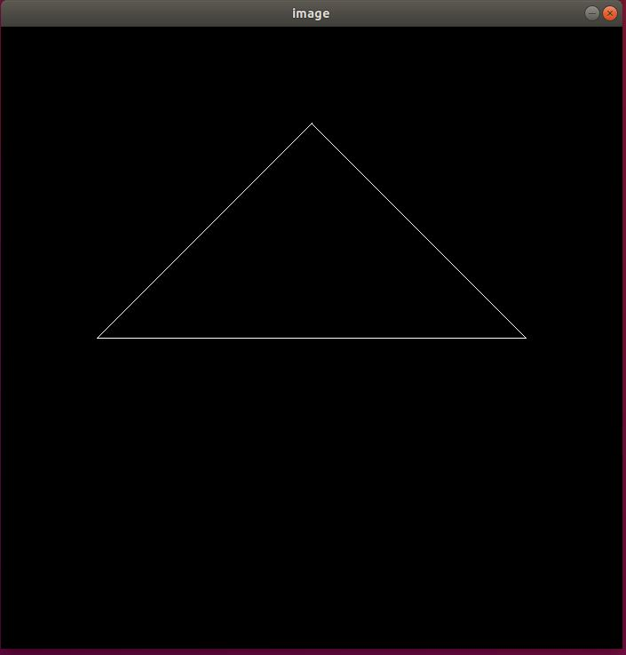

## 作业二

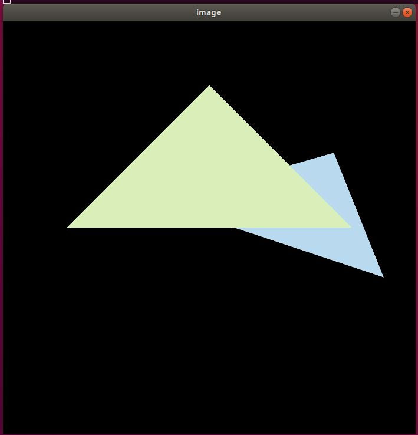

## 作业三

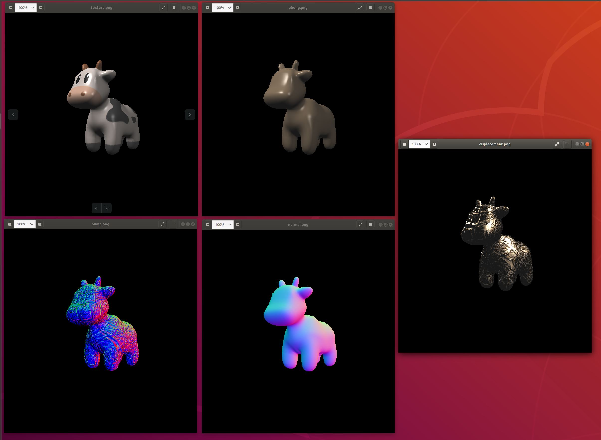

## 作业四

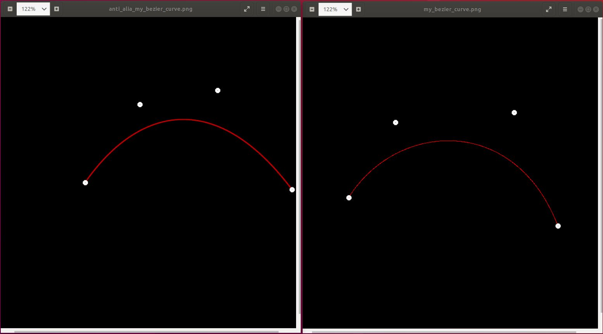

## 作业五

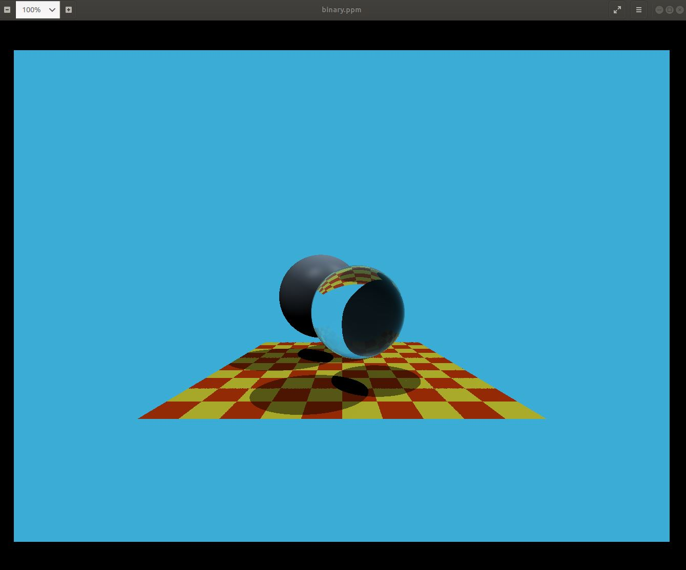

## 作业六

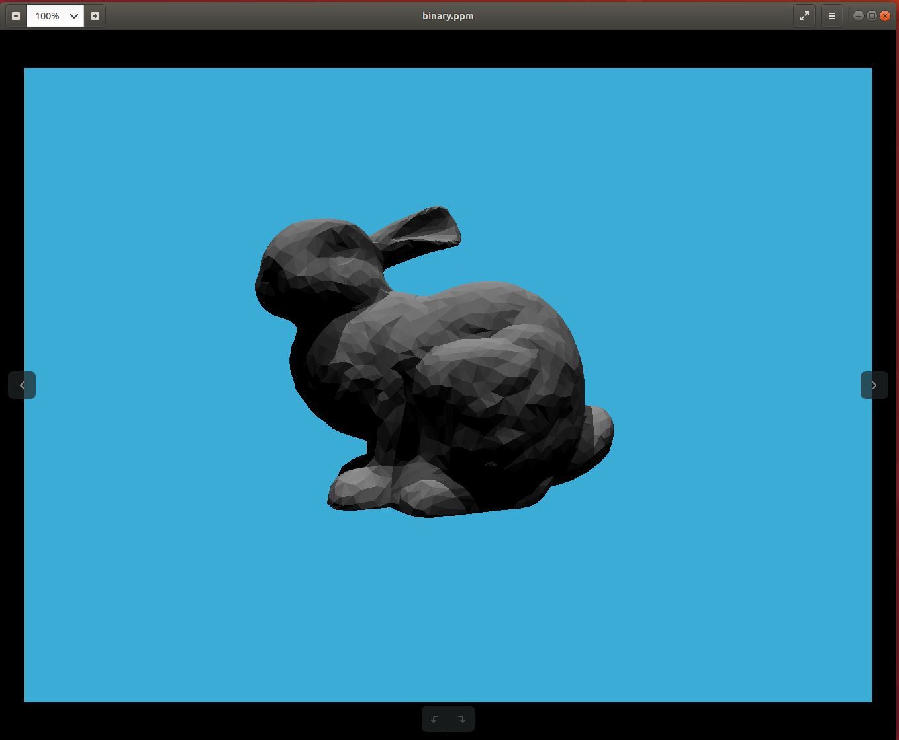

将MeshTriangle::MeshTriangle的bvh = new BVHAccel(ptrs, 1, BVHAccel::SplitMethod::NAIVE);

改成5之后且不开编译优化对比两种划分方法：

+ SAH。跑两次6049ms左右

  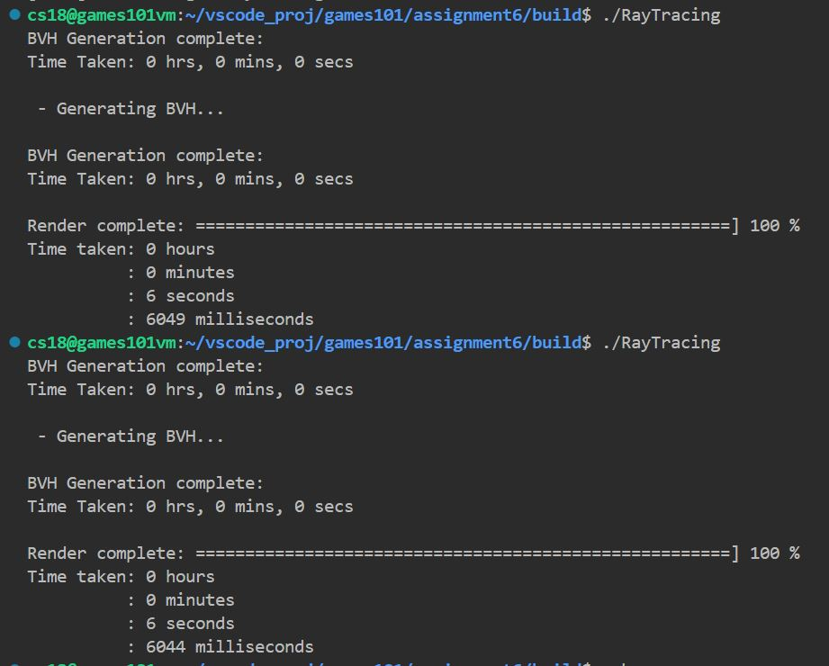

+ NAIVE。跑两次6609ms左右

  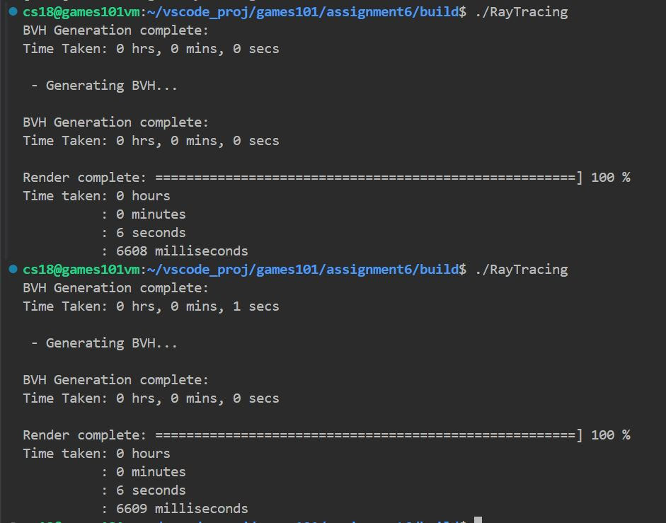

在原来基础上，应该是提升(6609 - 6049) / 6609=8%左右，还是有不错的效果，鉴于我实现的还有些我知道的没有完善的地方。

## 作业七

256spp的效果，没记错好像8线程，intel 8700的cpu跑了10多分钟。效果还是可以的

update：优化之后时间了很多

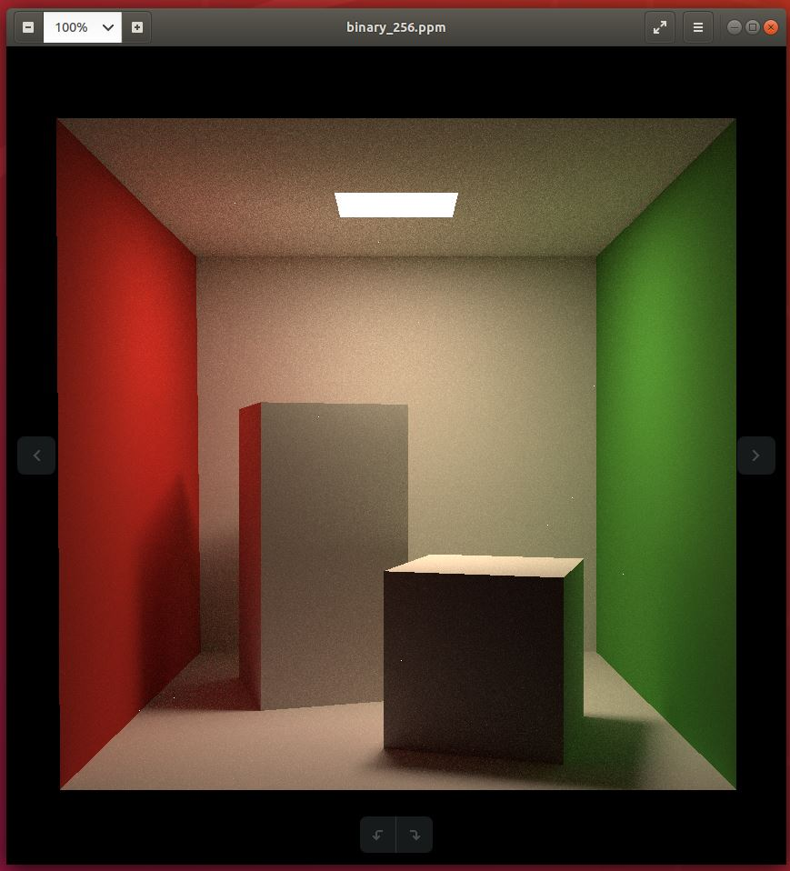

## 作业八

绿色的采用verlet积分，蓝色的是半隐式欧拉。图一是刚开始，图二是运行一段时间后。图二隐式欧拉变直了是由于弹簧的内部阻尼导致沿着弹簧上的能量被消耗，但是垂直弹簧方向没有阻尼，所以会钟摆运动一直下去

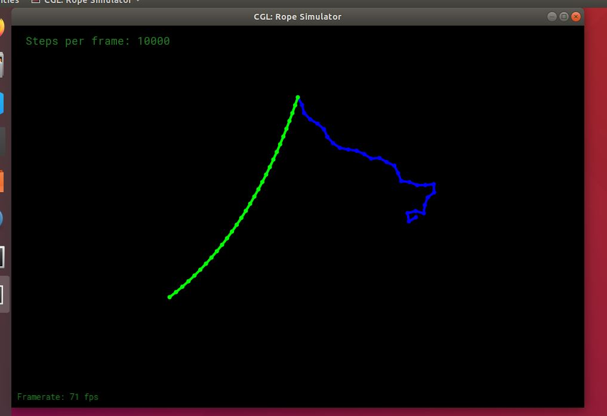
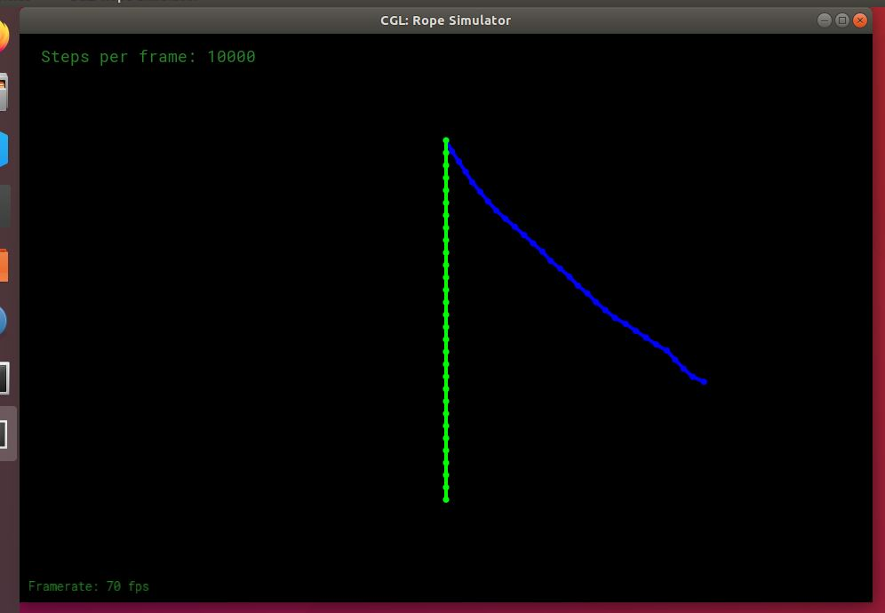