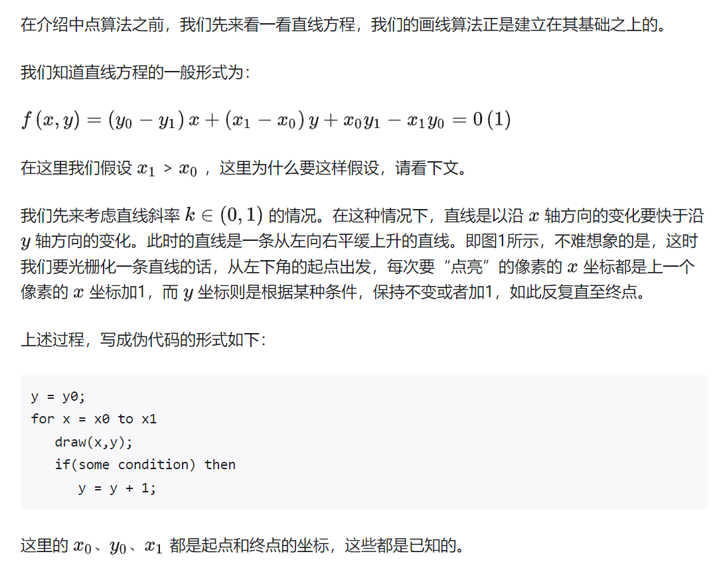
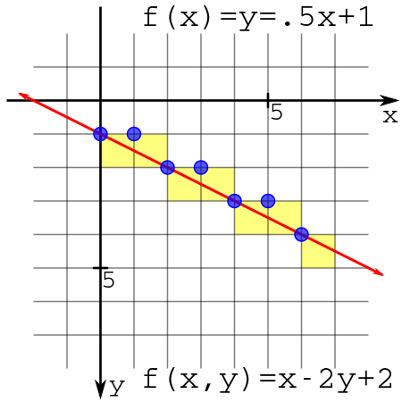
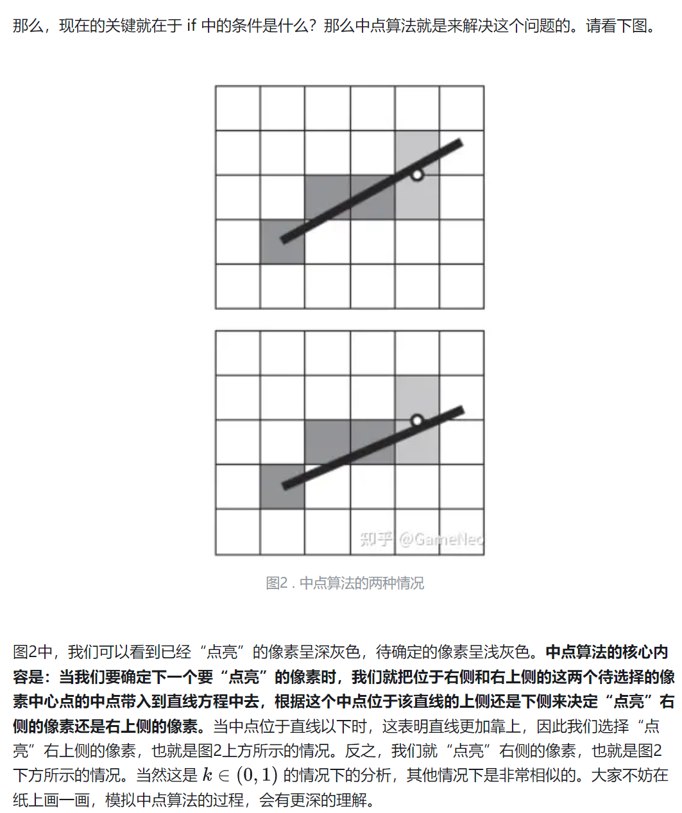
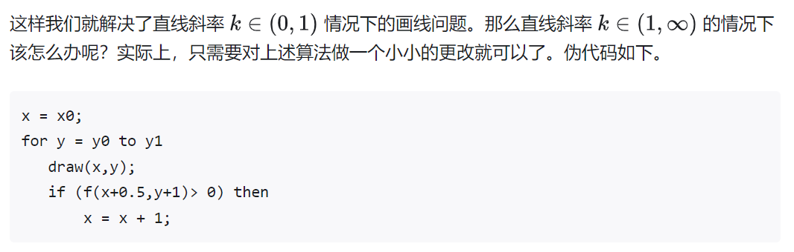

屏幕由像素构成（像素里在games101课程中介绍，不一定是一种颜色，但是为了简单考虑，可以想象成一种颜色）。在屏幕上画图的过程就是采用离散的像素点去逼近这个直线的过程。


常见的画线算法有：

+ 中点算法（Midpoint Algorithm）。
+ Bresenham算法。


## 中点算法



**由于屏幕像素的离散问题，起点和终点都是整数点。这也就是下面的中点算法的下一个测试点的坐标为(x + 1, y + 0.5)，这个坐标就是前一个像素的中点x + 1，y + 0.5，这里可以看下wiki中的图**






我们知道，如果一个点位于直线上，那么将它带入式（1），结果一定等于0。而如果一个点不在直线上，那么我们将它带入直线方程式（1）中，那么它要么大于0要么小于0。习惯上，我们希望当点位于直线上侧时，方程大于0，当点位于直线下侧时，方程小于0。**为了满足这个要求，就必须保证直线方程中y项前的系数大于0。**为什么要这样？小于0不可以吗？我们来看一个简单的例子。


```
y = y0;
for x = x0 to x1
   draw(x,y);
   if (f(x+1,y+0.5)< 0) then
       y = y + 1;
```





## Bresenham

采用增量形式，避免了获取中点值时每次计算直线方程。wiki上还做了优化，为避免浮点数运算，将方程值扩大了2倍（反正只需要判断正负）。


## 内容来自


1是wiki中，比较严谨，给出了所有情况。2是比较好理解，可以先看看文章2（文章2的坐标系更接近games101的坐标系），然后再看wiki会更加清楚

1. [Bresenham's line algorithm](img/https://en.wikipedia.org/wiki/Bresenham%27s_line_algorithm)

2. [计算机是怎么画线的？中点算法与Bresenham算法](https://zhuanlan.zhihu.com/p/549840815)