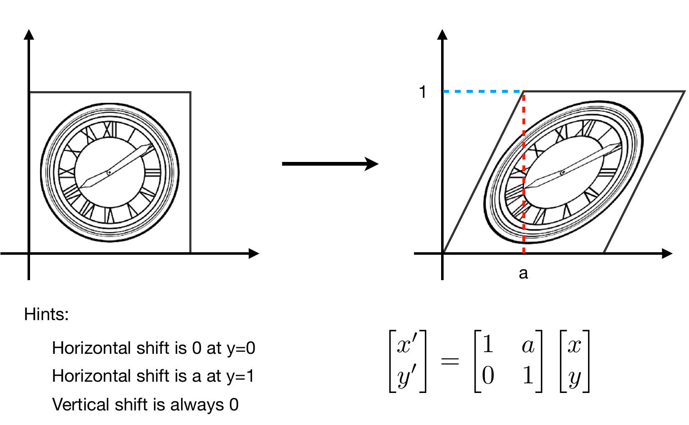

# Transformation（变换）

变换这一节内容还是比较简单，就是一些简单的线性代数的知识

## rotation

rotation旋转。旋转在默认情况下，没有说明那么就是绕着坐标原点做逆时针旋转。假设旋转的角度为Θ，图示的边长为a（为1也行），然后利用这里面正方形的两个标粗顶点的特殊点，计算出旋转矩阵的四个参数即可

## scale

scale，缩放。scale比较简单，s就是缩放的倍数，是一个对角矩阵

## shear

shear，切变。(x, y)和(x', y')分别表示变换前后的坐标点。这个shear有点类似于拉伸操作。

可以看下图左侧的一个提示，对于拉伸后的点，y坐标也就是vertical竖直高度是没有任何变化的。因此y' = y

对于水平方向的移动，最下面y=0位置上的移动为0，y=1（这里也可以假设y=b，那么左上的点的坐标就是(a,b) ）上的移动为a，此时移动最大。因此利用相似三角形Δx/a = y' / 1， 这里，Δx就是水平移动的偏移。因此Δx = a * y' = a * y，因此 x' = x + Δx = x + ay

就可以推导处下面的切变矩阵

## Reflection

reflection，反射。反射矩阵比较简单，就是沿着x=0对称一下。

## Linear Transforms

linear transforms。线性变换。

上面的rotation，scale，shear，Reflection都可以写成，x' = ax + by ,  y' = cx + dy这种形式，或者下面的矩阵表示，因此可以称为线性变换

## Translation

Translation，平移。对于平移变化，很容易写出x'与x之间的关系。

但是对于这种形式，写出来之后是这种形式，不能表示为线性变换。**为了能够找到一种统一的格式，将平移变换也放到里面表示，引入了齐次坐标的概念**

## Homogeneous Coordinates

Homogeneous Coordinates，即齐次坐标。

对于二维的坐标点来说，齐次坐标就是如下所示，增加了一个维度。对于点，第三个维度为1。对于向量，第三个维度为0

**为什么这么设置？**是为了满足点和向量的运算。举个例子，对于vector + vector场景，0 + 0 = 0，满足了两个向量相加还是向量的语义，其他的可以同理验证。

不过说明的是对于w != 0的场景，那么其实可以定义为一个点（同时除以w）。因此对于point + point的齐次坐标场景，就是这两个点的中点

## Affine Transformation

因此加入齐次坐标后，平移变换也能使用齐次坐标统一表示。把加入平移变换后的变换称为仿射变换（Affine Transformation）

> 需要注意一个先后顺序，x到x'的变换是先经过线性变换后（即经过abcd的矩阵操作），然后再经过平移变换得到的仿射变换，才能直接写出下面3 * 3的仿射变换矩阵。为什么是这样，算一下3*3的矩阵展开就行

## Transform Order

变换顺序（Transform Order）是有关系的

例如下面图表示先平移后旋转45°和先旋转后平移。是两个不一样的图。就线性代数的知识，**矩阵的运算不满足交换律**

## Composing Transforms
Composing Transforms，组合所有变换。由于变换可以理解成矩阵的运算，因此使用矩阵运算虽然不满足交换律，但是满足结合律，因此可以将多个仿射变换合成一个

## Inverse Transform

逆变换（Inverse Transform），由于线性代数的知识矩阵和逆矩阵积是单位矩阵，因此逆矩阵可以作为变换的逆变换理解

## Decomposing Complex Transforms
对于旋转点如果不是原点，那么需要对旋转进行分解
1. 先移动到原点
2. 进行旋转
3. 再移动回去

