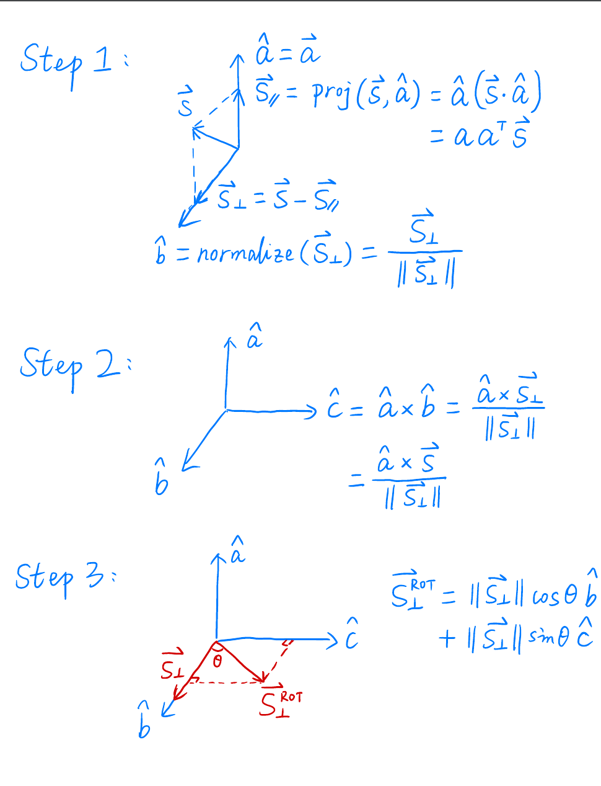

## 补充知识

补充知识见下图，$R_\theta$是一个普通的二维旋转矩阵的公式，我们发现逆向旋转用三角函数计算之后可以得到，$R_{-\theta}=R_{\theta}^{\mathrm{T}}$。又因为根据旋转的定义就能得到$R_{-\theta}=R_{\theta}^{-1}$

因此对于旋转矩阵而言，$R_{\theta}^{-1}=R^{\mathrm{T}}$，也就是一个旋转矩阵的逆就等于它的转置。这个对于理解三维的旋转公式为什么y轴旋转的特殊性很有帮助

### 三维绕轴旋转

围绕y轴旋转，因此y坐标对应的第二行是(0, 1, 0, 0)，因为y坐标是不变的。所以按照这个道理写出来应该是左侧的矩阵，为什么变成了上文中的$R_y$呢？
$$
M_y
\begin{pmatrix}
cos\alpha & 0 & -sin\alpha  & 0 \\
0 & 1 & 0 & 0 \\
sin\alpha & 0 & cos\alpha & 0\\
0 & 0 & 0 & 1
\end{pmatrix}

*
\begin{pmatrix}
x\\
y\\
z\\
1\\
\end{pmatrix}
$$

因为对于二维的矩阵旋转公式作用在(x, y)点上时，旋转方向时逆时针（默认是逆时针），即x到y轴的方向，也是第一个维度到第二维度的方向。

那么同理我们的3d模型围绕y轴旋转默认是逆时针，那么对应旋转投影到xoz平面旋转方向是z到x轴方向。因此此时如果运用上面的旋转矩阵My，那么得出来的旋转方向是x轴到z轴方向，与模型要求的方向是相反的，因此需要对$M_y$的旋转公式进行转置，才能保证反方向旋转

## 罗德里格斯旋转公式证明？

主要思路就是正交分解。确立三个向量$$\hat{a},\hat{b},\hat{c}$$其中$$\hat{a}$$是围绕旋转的向量。明确绕轴旋转时，原向量$$\vec{s}$$，围绕$$\hat{a}$$旋转之后的向量$$\vec{s}'$$在另外两个轴的形成的投影长度不变，s在轴方向上的投影也不变

参考下面的链接，一个是证明，一个是基础知识的讲解，还有一个是证明过程中要用到的投影矩阵的性质

https://www.zhihu.com/question/40049682
https://zhuanlan.zhihu.com/p/678550899
https://www.cnblogs.com/gxcdream/p/7597865.html

## 坐标空间

- 局部空间(Local Space，或者称为物体空间(Object Space))。可以理解为每个物体（模型）单独建模，然后每个模型会有自己的空间或者坐标系
- 世界空间(World Space)。很多物体经过一定的旋转，平移，缩放拼接到一个大的统一世界中
- 观察空间(View Space，或者称为视觉空间(Eye Space))。也可以称作camera space。就是相机会在世界空间中的某个位置摆放。按照相机三个参数（位置，朝向，正方向），这个相机会看到一定的物体构成的图像，为了保证这个图像的不变，通过对物体（模型）进行旋转，平移等操作。让相机位于这个新坐标空间的原点，正方向是y轴，观察方向是-z。
- 裁剪空间(Clip Space)。进行投影变换后，但是坐标还是使用**homogeneous coordinates**坐标
- NDC空间。对于裁剪空间的坐标进行perspective division（透视除法），保证所有的坐标都在(-1，1）的范围
- 屏幕空间(Screen Space)。映射到屏幕上，一般是对NDC空间的坐标点使用view port变换。

## view transformation

这个视图变换这里没有搞清楚的是为什么还要旋转$$\vec{g} \times \vec{t}$$到x轴上去，明明通过$\vec{e},\hat{t}, \hat{g}$确定了相机的所有参数，那么理论上只需要平移或者旋转这三个参数即可

更新：好像找到一个很类似的解释但是没看得很懂。https://stackoverflow.com/questions/56313743/cross-product-confusion

## project transformation

透视投影中。有个perspective division（透视除法？）。感觉操作就是Homogeneous坐标的normalize（每个分量都除以w）。这个不太理解的就是

关于上面一段话怎么理解，尤其是"这是也是另一个w分量很重要的原因，因为它能够帮助我们进行透射投影"。我理解在games101的lecture04的33页ppt里有个透视投影转正交投影的转换矩阵，矩阵如下。当这个$M_{persp}$左乘view space的齐次坐标（x，y，z，1），就会发现第四维坐标1变成了z，即w分量为z。如果该物体离相机越远，那么也就是|z|越大，即|w|越大，那么out对应的x，y就会越小，即实现了“近大远小“的效果。
$$
M_{persp->ortho}=               %左括号
  \begin{pmatrix}
    n & 0 & 0 & 0 \\  %第一行元素
    0 & n & 0 & 0 \\  %第一行元素
    0 & 0 & n+f & -nf \\  %第一行元素
    0 & 0 & 1 & 0 \\  %第一行元素
  \end{pmatrix}
  \\
  M_{ortho}= 
  \begin{pmatrix}
    \frac{2}{r-l} & 0 & 0 & 0 \\  
    0 & \frac{2}{t-b} & 0 & 0 \\  
    0 & 0 & \frac{2}{n-f} & 0 \\  
    0 & 0 & 0 & 1 
  \end{pmatrix}
  \begin{pmatrix}
    1 & 0 & 0 & -\frac{r+l}{2} \\  %第一行元素
    0 & 1 & 0 & -\frac{t+b}{2} \\  %第一行元素
    0 & 0 & 1 & -\frac{n+f}{2} \\  %第一行元素
    0 & 0 & 0 & 1 \\  %第一行元素
  \end{pmatrix}
  =
 \begin{pmatrix}
    \frac{2}{r-l} & 0 & 0 & -\frac{r+l}{r-l} \\  %第一行元素
    0 & \frac{2}{t-b} & 0 & -\frac{t+b}{t-b} \\  %第一行元素
    0 & 0 & \frac{2}{n-f} & -\frac{n+f}{n-f} \\  %第一行元素
    0 & 0 & 0 & 1 \\  %第一行元素
  \end{pmatrix}
$$
因此
$$
M_{persp1}=M_{ortho} * M_{persp->ortho}= 
  \begin{pmatrix}
    \frac{2}{r-l} & 0 & 0 & -\frac{r+l}{r-l} \\  %第一行元素
    0 & \frac{2}{t-b} & 0 & -\frac{t+b}{t-b} \\  %第一行元素
    0 & 0 & \frac{2}{n-f} & -\frac{n+f}{n-f} \\  %第一行元素
    0 & 0 & 0 & 1 \\  %第一行元素
  \end{pmatrix}
  \begin{pmatrix}
    n & 0 & 0 & 0 \\ 
    0 & n & 0 & 0 \\  
    0 & 0 & n+f & -nf \\  
    0 & 0 & 1 & 0 \\ 
  \end{pmatrix}
  \\
  =
  \begin{pmatrix}
    \frac{2n}{r-l} & 0 & -\frac{r+l}{r-l} & 0 \\ 
    0 & \frac{2n}{t-b} & -\frac{t+b}{t-b} & 0 \\ 
    0 & 0 & \frac{n+f}{n-f} & -\frac{2nf}{n-f} \\ 
    0 & 0 & 1 & 0 \\  
  \end{pmatrix}
$$

上面是的$M_{persp1}$是按照games101课程思路推导公式，是右手系，且所有的值都是带符号的坐标值，包括n和f。例如给定下面四个参数：
$$
垂直可视角度\ fovy = 45^{\circ} \\
宽高比\ aspect = \frac{1920}{1080} \\
近平面距离\ zNear = 0.1 \\
远平面距离\ zFar = 50
$$
则有：
$$
n = -zNear = -0.1 \\
f = -zFar = -50 \\
t = zNear * tan(\frac{fovy}{2}) = 0.04142136 \\
b = -t = −0.04142136 \\
r = t * aspect = 0.07363797 \\
l = -r = −0.07363797
$$

#### 透视投影矩阵变形2

**前面三个关于n，f, t的计算好理解，这个b=-t，l=-r这个怎么去理解呢？**，个人理解是一般情况下假设视锥是关于z轴心对称的。因此在这种情况下，上面的$M_{persp1}$又可以变为$M_{persp2}$：
$$
M_{persp2}=
  \begin{pmatrix}
    \frac{2n}{r-l} & 0 & 0 & 0 \\ 
    0 & \frac{2n}{t-b} & 0 & 0 \\ 
    0 & 0 & \frac{n+f}{n-f} & -\frac{2nf}{n-f} \\ 
    0 & 0 & 1 & 0 \\  
  \end{pmatrix}
$$

但是大家仔细看《深入理解透视矩阵》这个链接中的文章，就能发现文章中推导的透视投影矩阵与上面的$M_{persp2}$在第三行元素上存在一个-1的差别，这个差别是怎么引入的呢？

其实就是标记的这行引入的。因为n被映射到ndc的-1，f被映射成ndc的1。

但是在games的课程中，这个正交投影的映射明显是[f, n] => [-1, 1]，而不是将[n, f] => [-1, 1]。有兴趣的可以算一下，如果是[n, f]=>[-1, 1]。那么z在[n, f]中，z'在[-1, 1]中，那么算出来的结果就是《深入理解透视矩阵》中的方式，即上图中z'的那个等式。

这一点也可以通过games101的讨论《关于深度值问题自己踩的坑和一些想法》，一位作者的如下回答中可以看出

> 因为框架中的near是0.1，far是50.(这儿near,far都是距离值，是正值。我只能这么理解吧），所以f1,f2的作用就是把clip space的z值变换到[near,far]的范围中。我LOG了一下，第一个三角形的clip space z为 -0.975379，变换后为0.714285；第二个三角形从-0.983968变换到0.50002。因为框架中一直使用的是右手坐标系，且view space的view方向为-z。因为第一个三角形的z值-0.97xx大于第二个三角形的-0.98xxx，离camera更近，所以第一个三角形应该挡住第二个三角形

作者LOG了一下，即打出的日志，第一个三角形的ndc（应该是ndc，已经进行了透视除法了）的z坐标是： -0.975379，第二个三角形的z坐标是-0.983968（ps：这和我打出来的日志是一致的），因为是近平面映射到ndc的1，那么z值越大证明离相机越近，从这个计算中应该可以得出是第一个三角形遮住了第二个三角形。所以和作者的判断是一致的。

#### 透视投影矩阵变形3

因此根据上面的说明，我们可以得到《深入理解透视矩阵》里面指定的变形即：

$$
M_{persp3}=
  \begin{pmatrix}
    \frac{2n}{r-l} & 0 & 0 & 0 \\ 
    0 & \frac{2n}{t-b} & 0 & 0 \\ 
    0 & 0 & \frac{n+f}{f-n} & -\frac{2nf}{f-n} \\ 
    0 & 0 & 1 & 0 \\  
  \end{pmatrix}
$$

#### 透视投影矩阵变形4

根据《深入理解透视矩阵》文章中的说法，《Mathematics for 3D Game Programming and Computer Graphics Third Edition》的5.5.1 也给出了一个透视投影矩阵，但是表示方法n和f不是坐标值，用本文一致的表示方法表示该矩阵即：
$$
M_{persp4}=
  \begin{pmatrix}
    \frac{2*zNear}{r-l} & 0 & \frac{r+l}{r-l} & 0 \\ 
    0 & \frac{2*zNear}{t-b} & \frac{t+b}{t-b} & 0 \\ 
    0 & 0 & -\frac{zFar+zNear}{zFar-zNear} & -\frac{2*zFar*zNear}{zFar-zNear} \\ 
    0 & 0 & -1 & 0 \\  
  \end{pmatrix}
$$

其中r，l，t，b的含义和以前相同。zNear和zFar表示距离值为正数。

如果将n=-zNear，f=-zFar带入$M_{persp3}$， 对比$M_{persp4}$就能发现两点差异：

1. 第三列的前两行元素不为0。这个前面已经解释过了
2. 整体相差一个负号。这个是因为该透视投影矩阵使用的是-1，即和view space的坐标运算时（x，y，z，1），w将存储-z参数，为了保证从clip space->ndc坐标转换的不变性（用的是-1，那么透视除法要除以-z），因此透视投影矩阵整体都要在$M_{persp3}$的基础上改变一个符号

#### 透视投影矩阵变形5

这个变形就很简单，利用fovy和aspect的定义，在$M_{persp4}$的基础上进行替换即可
$$
M_{persp5}=
  \begin{pmatrix}
    \frac{1}{tan({\frac{fovy}{2}})*aspect} & 0 & 0 & 0 \\ 
    0 & \frac{1}{tan(\frac{fovy}{2})} & 0 & 0 \\ 
    0 & 0 & -\frac{zFar+zNear}{zFar-zNear} & -\frac{2*zFar*zNear}{zFar-zNear} \\ 
    0 & 0 & -1 & 0 \\  
  \end{pmatrix}
$$

内容来自：

1. https://stackoverflow.com/questions/25584667/why-do-i-divide-z-by-w-in-a-perspective-projection-in-opengl?rq=3

2. [深入理解透视矩阵](https://juejin.cn/post/7085176703085412383)
3. [关于深度值问题自己踩的坑和一些想法](https://games-cn.org/forums/topic/zuoye3-guanyushenduzhiwentizijicaidekengheyixiexiangfa/)
4. [坐标系统](https://learnopengl-cn.readthedocs.io/zh/latest/01%20Getting%20started/08%20Coordinate%20Systems/)
5. [From Clip Space to NDC Space](https://carmencincotti.com/2022-11-28/from-clip-space-to-ndc-space/#ndc-space)
