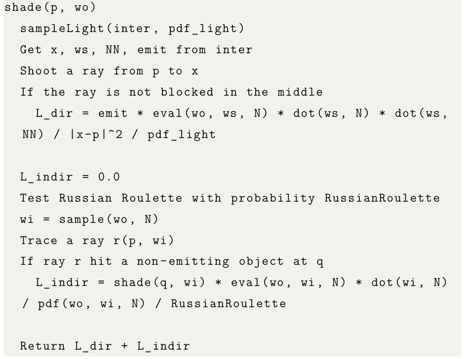
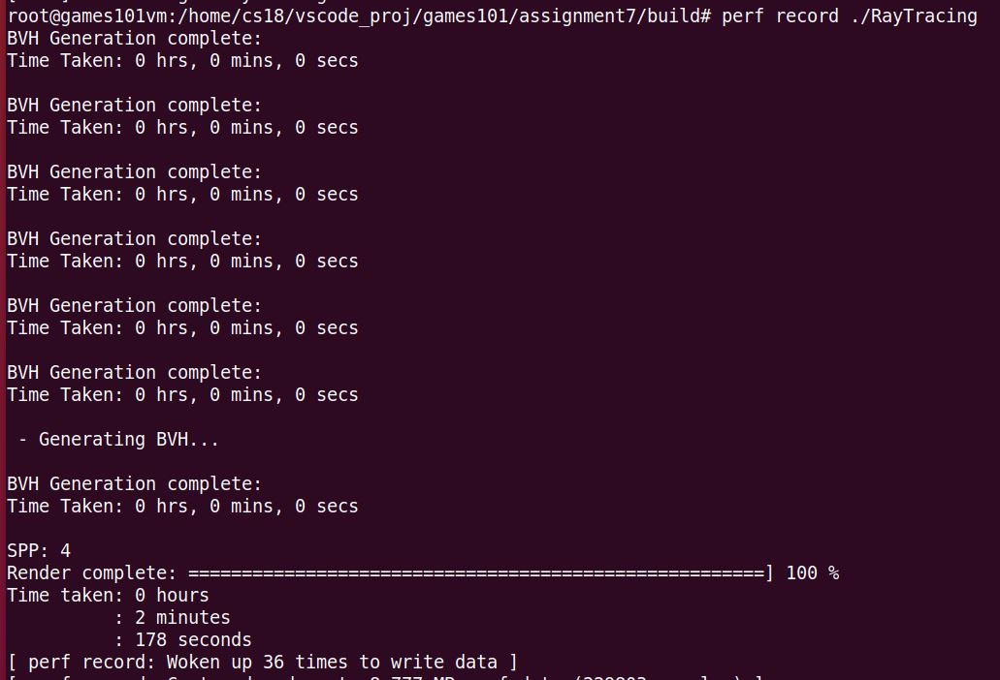
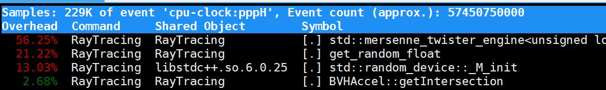
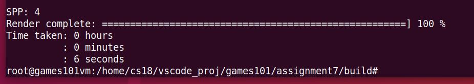
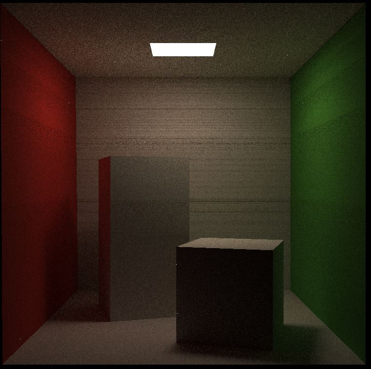
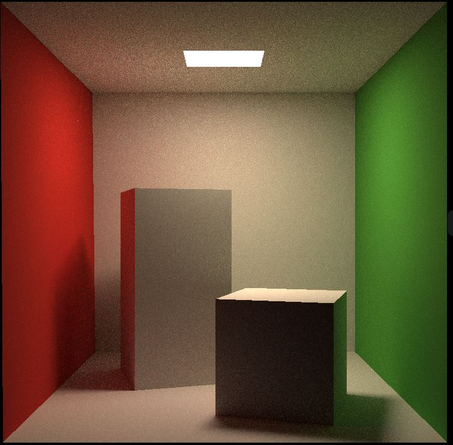

## 包围盒判断代码的边界条件，导致渲染全黑

这是我在作业六中使用的包围盒的判断代码，个人觉得写得比较优雅。在作业六中运行良好。

```c++
inline bool Bounds3::IntersectP(const Ray& ray, const Vector3f& invDir,
                                const std::array<int, 3>& dirIsNeg) const
{
    // invDir: ray direction(x,y,z), invDir=(1.0/x,1.0/y,1.0/z), use this because Multiply is faster that Division
    // dirIsNeg: ray direction(x,y,z), dirIsNeg=[int(x>0),int(y>0),int(z>0)], use this to simplify your logic
    // test if ray bound intersects

    float t_enter = std::numeric_limits<float>::lowest(), t_exit = std::numeric_limits<float>::max();
    float t_min, t_max;
    for (int i = 0; i < 3; ++i)
    {
        t_min = (pMin[i] - ray.origin[i]) * invDir[i];
        t_max = (pMax[i] - ray.origin[i]) * invDir[i];
        if (dirIsNeg[i])
            std::swap(t_min, t_max);
        t_enter = std::max(t_enter, t_min);
        t_exit = std::min(t_exit, t_max);
    }

    return t_enter < t_exit && t_exit >= 0;    
}
```


但是在作业七中，发现渲染结果一片黑色。经过一天的分析，最终定位到了这个问题。就是最后的`t_enter < t_exit`判断少了一个等号。那讲道理对于图形学来说，边界条件不是那么重要，**那为什么作业7的场景这个边界条件有如此大的差异呢？**


这是个发自灵魂的拷问，我是分析了好一会。原因是conellbox的物体添加代码如下

```c++
    scene.Add(&floor);
    scene.Add(&shortbox);
    scene.Add(&tallbox);
    scene.Add(&left);
    scene.Add(&right);
    scene.Add(&light_);
```

而以左边的墙，left这个MeshTriangle为例，大家看这个obj文件的内容：

```
v 552.8 0.0 0.0 
v 549.6 0.0 559.2
v 556.0 548.8 559.2
v 556.0 548.8 0.0
f 1 2 3
f 1 3 4
```

很容易就能发现，墙是两个三角形构成，并且墙这个平面是平行于yz平面的。这就会导致墙的bvh在x轴方向上的厚度为0。就自然会出现IntersectP中t_enter == t_exit。同理光源也是一样。这样如果在IntersectP中对进入和出去时间的判断没有等号，就会导致判断光线和bvh不相交，也就是光线打不到光源，就会出现场景全黑的情况。


## 光源区域为纯黑的问题


看实现的伪代码就能知道：



下面是我根据伪代码的一个实现的部分代码:

```c++
    // 先对面光源均匀采样，采样点的位置用x表示
    float pdf_light;
    Intersection x;
    sampleLight(x, pdf_light);

    Vector3f ws = x.coords - p.coords;
    float distance = ws.norm();
    ws = normalize(ws);
    // 然后发出一条光线px，即检查着色点p和光源x之间是否有遮挡
    auto inter = intersect(Ray(p.coords, ws));
    // 没有遮挡则计算直接光照
    Vector3f l_dir(0);
    if (inter.happened && std::fabs(inter.distance - distance) < EPSILON)    
    {
        l_dir = x.emit * p.m->eval(wo, ws, p.normal) * dotProductPositive(ws, p.normal) * dotProductPositive(-ws, x.normal)/ (distance * distance) / pdf_light;
    }
```

如果着色点正好落在光源上，那么ws向量就肯定和p.normal和x.normal两个向量垂直，自然直接光照l_dir就会是0。

> 其实应该都走不到里面的逻辑，因为我判断着色点p和光源采样点x之间有没有遮挡使用了距离。如果p和x在光源上，那么inter.coords == p，光线与光源平面的交点就是光线的起点p，那么std::fabs(inter.distance - distance) < EPSILON，这个判断显然就不满足条件

## 性能分析

### 打开编译优化

作为一个被编译折腾得不轻的c++工程师，第一步提高渲染效率的方法就是打开编译优化。这个cmake里面好解决，加个下面的命令，就会打开gcc的O3的编译优化。可以在CMakeFiles目录的flags.make文件中看到是否生效

```
set(CMAKE_BUILD_TYPE Release)
```

性能对比就不贴图了，按照经验至少有2-3倍的性能提升。

### perf分析性能瓶颈

编译优化之后，在spp=4的情况下。需要177s渲染（直接跑，没有使用perf）。还是太慢了，因此需要请出perf对程序性能进行分析。


如果使用perf记录数据，时间是下图所示的178秒。记录后会在当前目录生成一个perf.data的文件



使用perf report命令，就会默认读取perf.data文件，读取之后的输出如下。



第一行是记录了57450750000个cpu-clock的事件。然后在这个事件中：

+ 56%的消耗在`std::mersenne_twister_engine`。std::mt19937是C++标准库中的一个伪随机数生成器类，它实现了梅森旋转算法（Mersenne Twister）
+ 13%的消耗在`std::random_device::_M_init`。random_device对象的构造。

我们看下关键代码：

```c++
inline float get_random_float()
{
    std::random_device dev;
    std::mt19937 rng(dev());
    std::uniform_real_distribution<float> dist(0.f, 1.f); // distribution in range [1, 6]

    return dist(rng);
}
```

这下就能明白性能瓶颈在哪里了。一个是random_device的构造和mt19937的构造。通过stackoverflow的链接也能证明。[how-do-i-generate-thread-safe-uniform-random-numbers](https://stackoverflow.com/questions/21237905/how-do-i-generate-thread-safe-uniform-random-numbers)

> perf的输出中还有个有点奇怪的地方——get_random_float的消耗占了21%？然而get_random_float函数的两个函数调用56%+13%都超过了21%？这个perf的输出不能这么理解，perf工作方式就是每次记录cpu-clock事件时pc(程序计数器)位于哪个symbol。因此在get_random_float中，能内联的部分都算到了get_random_float中。像不能内联的都mersenne_twister_engine和`random_device::_M_init`会单独统计。因此21%可以说是get_random_float不能内联的函数调用消耗的时间，不包括前面说的两个函数。

解决方法也很简单，将这两个对象的构造声明为static（程序声明周期唯一，这里暂时只有单线程不会有问题）或者是thread_local（单线程唯一）。这里选用后者，因为后面需要使用多线程加速。

```c++
inline float get_random_float()
{
    thread_local std::random_device dev;
    thread_local std::mt19937 rng(dev());
    std::uniform_real_distribution<float> dist(0.f, 1.f); // distribution in range [1, 6]

    return dist(rng);
}
```

修改之后还是很明显，从177s->6s。提升效果显著。感谢perf，perf还是很强大。



### 多线程加速

比较简单，使用了一个线程池，这样代码更好理解。其实如果线程池对spp进行划分（每个线程直接执行castRay），而不是像现在这样对行操作（每个线程执行row_oper）代码改动会非常少而且也好理解。但是带来的问题就是线程池的每个线程只执行一次castRay，这样计算时间非常短，主要的消耗就在，线程池的线程归还和切换上。此时可以用top -H -p pid查看运行状态，发现单个核心CPU负载在40%左右。而改用这种划分单个核心可以跑满100%。

```c++
   auto row_oper = [imageAspectRatio, &scene ,scale, spp, &eye_pos](int param_j) -> std::vector<Vector3f> {
        std::vector<Vector3f> row_frame(scene.width);
        for (uint32_t i = 0; i < scene.width; ++i) {
            // generate primary ray direction
            float x = (2 * (i + 0.5) / (float)scene.width - 1) *
                      imageAspectRatio * scale;
            float y = (1 - 2 * (param_j + 0.5) / (float)scene.height) * scale;

            Vector3f dir = normalize(Vector3f(-x, y, 1));
            for (int k = 0; k < spp; k++){
                row_frame[i] += scene.castRay(Ray(eye_pos, dir), 0) / spp;  
            }
        }
        return row_frame;
    };
    for (uint32_t j = 0; j < scene.height; ++j) {
        results[j] = executor.commit(row_oper, j);
    }
    for (uint32_t j = 0; j < scene.height; ++j) {
        std::vector<Vector3f> row_frame = results[j].get();
        for (uint32_t i = 0; i < scene.width; ++i) 
        {
            framebuffer[j * scene.width + i] = row_frame[i];
        }
        UpdateProgress(j / (float)scene.height);
    }
    UpdateProgress(1.f);
```


## 黑线问题

在使用上多线程之后，开6个线程，我的intel 8700的CPU也需要1026 seconds才能渲染spp=128的场景。



但是虽然spp提高了之后，场景的噪声少了很多。但是还有一些黑色的横线。并且整个场景都比框架的pdf里面给出的样例要暗上不少。这两个问题的原因就是下面计算直接光照的代码：

```c++
// 没有遮挡则计算直接光照
    Vector3f l_dir(0);
    if (inter.happened && std::fabs(inter.distance - distance) < EPSILON)    
    {
        l_dir = x.emit * p.m->eval(wo, ws, p.normal) * dotProductPositive(ws, p.normal) * dotProductPositive(-ws, x.normal)/ (distance * distance) / pdf_light;
    }
```

因为浮点数的计算精度，可以适当的提高这个`std::fabs(inter.distance - distance) < EPSILON`判断中EPSILON的值，这样就能保证更多的点受到了直接光照，这样包括间接光照在内，整个场景的亮度都会提升。下图是我将EPSILON扩大10倍之后，其他参数不变的效果




## 不太理解的代码

` Scene::sampleLight`计算pdf的代码最终其实是通过下面的函数调用计算的。如果按照对光源均匀采样，其实就是pdf就应该是课件中的1/A。下面这个p去开方的作用有点难以理解。理论上一个均匀的[0-1]的随机数列，开方之后应该不再均匀，而且是向1的那侧分布较密，这样还能是均匀采样吗？

```c++
void BVHAccel::getSample(BVHBuildNode* node, float p, Intersection &pos, float &pdf){
    if(node->left == nullptr || node->right == nullptr){
        node->object->Sample(pos, pdf);
        pdf *= node->area;
        return;
    }
    if(p < node->left->area) getSample(node->left, p, pos, pdf);
    else getSample(node->right, p - node->left->area, pos, pdf);
}
void BVHAccel::Sample(Intersection &pos, float &pdf){
    float p = std::sqrt(get_random_float()) * root->area;
    getSample(root, p, pos, pdf);
    pdf /= root->area;
}
```

