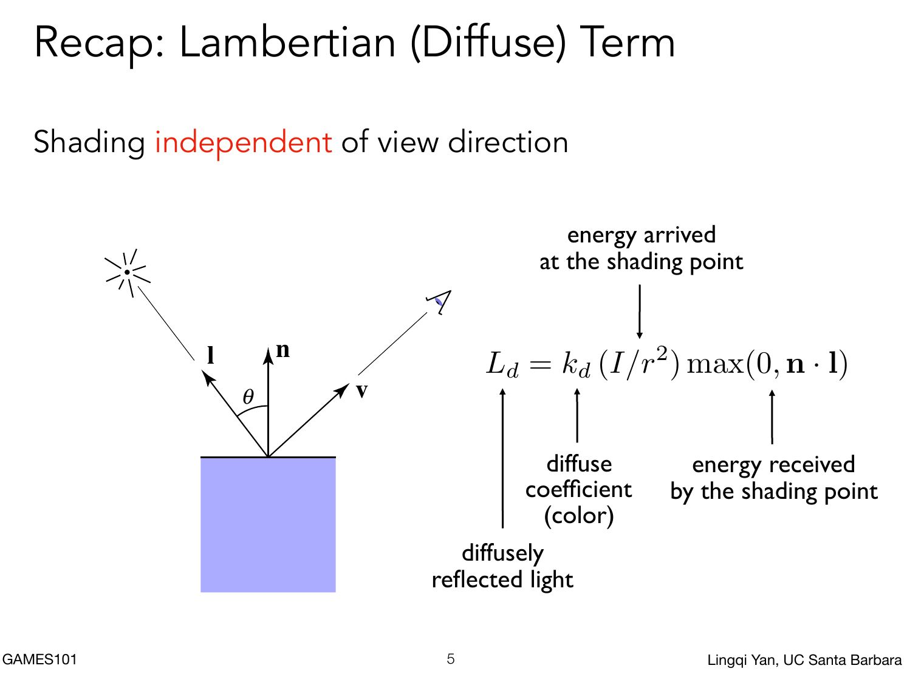

## 法线贴图中的tbn矩阵

看到了几个链接觉得还ok：

计算机图形学八：纹理映射的应用(法线贴图，凹凸贴图与阴影贴图等相关应用的原理详解) https://zhuanlan.zhihu.com/p/144357517

计算机图形学：凹凸贴图、法线贴图、切线空间、TBN矩阵：https://www.cnblogs.com/HDDDDDD/p/15335800.html，个人觉得还是总结得不错

下面这两个就比较权威：

Normal Mapping https://learnopengl.com/Advanced-Lighting/Normal-Mapping

Tutorial 13 : Normal Mapping https://www.opengl-tutorial.org/intermediate-tutorials/tutorial-13-normal-mapping/

暂时不懂怎么用，感觉上面资料里面的计算方法和作业里面的很不一样。


2024.11.12更新

好像懂了一部分。

**我们知道法线贴图是用纹理图片记录法线信息，然后通过贴图记录的法线信息来重新计算光照。但是由于纹理图片一般不是整个场景，是场景中某类物品的一小部分，是能够复用的。learn opengl中就以墙面的纹理为例，可以放在地上，也可以放在左右，可以放在正对我们视线的位置。如果此时墙面的纹理法线值是一个世界坐标的绝对值，这种纹理放在不同位置重复使用就会导致法线值不正确**


因此更常见做法是用一个相对值或者是局部值。例如建立一个局部空间，表示法向量。(0, 0, 1)就表示法向量没有改变。下面的tangent space就是一个局部空间，view就是相机空间。可以把（0，0，1）带入右边试试

$$
\begin{bmatrix}
x_{view}  \\
y_{view}  \\
z_{view}  \\
\end{bmatrix}
=
\begin{bmatrix}
T_x & B_x & N_x \\
T_y & B_y & N_y \\
T_z & B_z & N_z \\
\end{bmatrix}

\begin{bmatrix}
x_{tangent}  \\
y_{tangent}  \\
z_{tangent}  \\
\end{bmatrix}
$$


切线空间由三个互相正交的基向量t,b,n组成。首先，切线空间定义在模型的每一个顶点上，切线空间的原点就是顶点本身，z轴是顶点的法线方向，也称为n轴（normal）；x轴是顶点的切线方向，也称为t轴（tangent）；y轴由法线和切线叉乘得到，也叫副切线，称为b轴（bitangent）。


tbn是一个旋转矩阵，用于坐标系间的向量进行转换（这里就是tangent空间的向量向相机空间或者世界空间转换）。这种矩阵的求法我在《view变换》中已经总结：要求出这个tbn矩阵，需要求出三个坐标轴向量在相机空间（或者世界）的坐标。目前已知的就是法向量——N在相机空间的坐标值，需要求解的是T和B：


其实T和B的选择有很多，但是opengl的turorial给出了一个选择的理由（为了避免ugly edges，tagent的方向应该和纹理坐标对齐）：

Which one should we choose ? In theory, any, but we have to be consistent with the neighbors to avoid introducing ugly edges. The standard method is to orient the tangent in the same direction that our texture coordinates

因此，就出现了下面很多文章中都能看到的图：


P1，P2，P3就是相机空间的三个点，U，V就是对应的纹理坐标
$$
\Delta U_2 = U_3 - U_2
\\
\Delta V_2 = V_3 - V_2
\\
\Delta U_1 = U_1 - U_2
\\
\Delta V_1 = V_1 - V_2
\\
E_2 = P_3 - P_2
\\
E_1 = P_1 - P_2
$$
根据图示和向量的加法，上面的解释没有问题，只是命名看上去有些诡异（$\Delta U_2 改为 \Delta U_3可能会好点$）。例如$\Delta U_2 T$表示的就是$E_2$为斜边对应的三角形的红色向量，$\Delta V_2 B$就是绿色向量，两个加起来就是$\Delta E_2$：
$$
E_2 = \Delta U_2T + \Delta V_2B
$$

以及下面的经典公式了：


其实这里的问题在于：

1. T和B对齐U和V就是这么对齐的?$ E_2 = \Delta U_2T + \Delta V_2B$，好像还是有点抽象？
1. 在实际计算中P1，P2，P3的选择问题或者说tbn具体的计算流程。我们知道要计算法线一般进入到了shader里面。而fragment shader已经是计算采样点的颜色了，所以fragment shader前必须要把tbn矩阵计算出来，才能计算新的法线，从而计算颜色。因此这个tbn矩阵，只能在vertex shader或者更前的步骤进行。


对于问题1，暂时没想到好的解释。


对于问题2，幸好有参考，注释一下部分代码。https://learnopengl.com/code_viewer_gh.php?code=src/5.advanced_lighting/4.normal_mapping/normal_mapping.cpp。

```c++
unsigned int quadVAO = 0;
unsigned int quadVBO;
void renderQuad()
{
    if (quadVAO == 0)
    {
        // 正方形对应的四个顶点 从quadVertices 也可以看出来，四个顶点构成了两个三角形（pos1, pos2, pos3）和（pos1，pos2，pos4）
        glm::vec3 pos1(-1.0f,  1.0f, 0.0f);
        glm::vec3 pos2(-1.0f, -1.0f, 0.0f);
        glm::vec3 pos3( 1.0f, -1.0f, 0.0f);
        glm::vec3 pos4( 1.0f,  1.0f, 0.0f);
        // 四个顶点对应的纹理坐标
        glm::vec2 uv1(0.0f, 1.0f);
        glm::vec2 uv2(0.0f, 0.0f);
        glm::vec2 uv3(1.0f, 0.0f);  
        glm::vec2 uv4(1.0f, 1.0f);
        // 四个顶点在同一个平面上，四个顶点构成两
        glm::vec3 nm(0.0f, 0.0f, 1.0f);

        // calculate tangent/bitangent vectors of both triangles
        glm::vec3 tangent1, bitangent1;
        glm::vec3 tangent2, bitangent2;
        // triangle 1
        // ----------
        glm::vec3 edge1 = pos2 - pos1;
        glm::vec3 edge2 = pos3 - pos1;
        glm::vec2 deltaUV1 = uv2 - uv1;
        glm::vec2 deltaUV2 = uv3 - uv1;

        float f = 1.0f / (deltaUV1.x * deltaUV2.y - deltaUV2.x * deltaUV1.y);

        tangent1.x = f * (deltaUV2.y * edge1.x - deltaUV1.y * edge2.x);
        tangent1.y = f * (deltaUV2.y * edge1.y - deltaUV1.y * edge2.y);
        tangent1.z = f * (deltaUV2.y * edge1.z - deltaUV1.y * edge2.z);

        bitangent1.x = f * (-deltaUV2.x * edge1.x + deltaUV1.x * edge2.x);
        bitangent1.y = f * (-deltaUV2.x * edge1.y + deltaUV1.x * edge2.y);
        bitangent1.z = f * (-deltaUV2.x * edge1.z + deltaUV1.x * edge2.z);

        // triangle 2
        // ----------
        edge1 = pos3 - pos1;
        edge2 = pos4 - pos1;
        deltaUV1 = uv3 - uv1;
        deltaUV2 = uv4 - uv1;

        f = 1.0f / (deltaUV1.x * deltaUV2.y - deltaUV2.x * deltaUV1.y);

        tangent2.x = f * (deltaUV2.y * edge1.x - deltaUV1.y * edge2.x);
        tangent2.y = f * (deltaUV2.y * edge1.y - deltaUV1.y * edge2.y);
        tangent2.z = f * (deltaUV2.y * edge1.z - deltaUV1.y * edge2.z);


        bitangent2.x = f * (-deltaUV2.x * edge1.x + deltaUV1.x * edge2.x);
        bitangent2.y = f * (-deltaUV2.x * edge1.y + deltaUV1.x * edge2.y);
        bitangent2.z = f * (-deltaUV2.x * edge1.z + deltaUV1.x * edge2.z);

		// 这个数据经过VAO定义解析后需要传递给vertex shader
        float quadVertices[] = {
            // positions            // normal         // texcoords  // tangent                          // bitangent
            pos1.x, pos1.y, pos1.z, nm.x, nm.y, nm.z, uv1.x, uv1.y, tangent1.x, tangent1.y, tangent1.z, bitangent1.x, bitangent1.y, bitangent1.z,
            pos2.x, pos2.y, pos2.z, nm.x, nm.y, nm.z, uv2.x, uv2.y, tangent1.x, tangent1.y, tangent1.z, bitangent1.x, bitangent1.y, bitangent1.z,
            pos3.x, pos3.y, pos3.z, nm.x, nm.y, nm.z, uv3.x, uv3.y, tangent1.x, tangent1.y, tangent1.z, bitangent1.x, bitangent1.y, bitangent1.z,

            pos1.x, pos1.y, pos1.z, nm.x, nm.y, nm.z, uv1.x, uv1.y, tangent2.x, tangent2.y, tangent2.z, bitangent2.x, bitangent2.y, bitangent2.z,
            pos3.x, pos3.y, pos3.z, nm.x, nm.y, nm.z, uv3.x, uv3.y, tangent2.x, tangent2.y, tangent2.z, bitangent2.x, bitangent2.y, bitangent2.z,
            pos4.x, pos4.y, pos4.z, nm.x, nm.y, nm.z, uv4.x, uv4.y, tangent2.x, tangent2.y, tangent2.z, bitangent2.x, bitangent2.y, bitangent2.z
        };
        // configure plane VAO
        ...
    }
    ...
}
```

因此我们再看下vertexshader的代码：

```glsl
#version 330 core
// 这几个变量就是quadVertices中注释的几个，通过location与glVertexAttribPointer指定的location匹配
layout (location = 0) in vec3 aPos;
layout (location = 1) in vec3 aNormal;
layout (location = 2) in vec2 aTexCoords;
layout (location = 3) in vec3 aTangent;
layout (location = 4) in vec3 aBitangent;

out VS_OUT {
    vec3 FragPos;
    vec2 TexCoords;
    vec3 TangentLightPos;
    vec3 TangentViewPos;
    vec3 TangentFragPos;
} vs_out;

uniform mat4 projection;
uniform mat4 view;
uniform mat4 model;

uniform vec3 lightPos;
uniform vec3 viewPos;

void main()
{
    vs_out.FragPos = vec3(model * vec4(aPos, 1.0));   
    vs_out.TexCoords = aTexCoords;
    
    mat3 normalMatrix = transpose(inverse(mat3(model))); // 法线变换矩阵
    vec3 T = normalize(normalMatrix * aTangent);        // aTangent类似于法线，也要做个变换，变换到相机空间
    vec3 N = normalize(normalMatrix * aNormal);
    T = normalize(T - dot(T, N) * N);                   // 保证T与N正交
    vec3 B = cross(N, T);
    
    mat3 TBN = transpose(mat3(T, B, N));    // 这里转置是为了将光源， 观察点， shading point变换到tangent space，如果在相机空间做shading，应该是不需要转置的
    vs_out.TangentLightPos = TBN * lightPos;
    vs_out.TangentViewPos  = TBN * viewPos;
    vs_out.TangentFragPos  = TBN * vs_out.FragPos;
        
    gl_Position = projection * view * model * vec4(aPos, 1.0);
}
```


因此从上面的代码中：对于每个三角形面，利用三角形三个顶点，顶点对应的uv坐标，面法线（看不出顶点还是面，感觉根据原理面法线就够了），计算tangent和bitangent（这个bitagent好像没用，后面用了叉乘）。然后在shader中将面法线和tagent向量乘以法线变换矩阵，再叉乘出B，然后构成真正的tbn。


但是写到这里，我的问题就更多了。

1. 讲道理tbn不是一个局部空间的变换吗？那就是说一个纹理只需要一个tbn矩阵就够了？为什么每个三角形还要算一下。
2. 仔细看games的作业三，使用的法线是顶点法线。我还打印了一下，确实同一个三角形面的三个顶点法线值不一样。这个面法线从哪里来？用顶点法线做平均值，还是说直接三角形两个边的叉乘？


而且作业三的代码框架给的tbn矩阵计算方式如下，看了一下https://games-cn.org/forums/topic/zuoye3-bump-mappingzhongtbndet-gongshizenmetuidaode/这个讨论才看懂什么意思：

```
// Let n = normal = (x, y, z)
// Vector t = (x*y/sqrt(x*x+z*z),sqrt(x*x+z*z),z*y/sqrt(x*x+z*z))
// Vector b = n cross product t
// Matrix TBN = [t b n]
```

这个t的计算确实一下子有点难以看懂，结合我下面的图说可能好理解一点。


现在已知的是左侧图中的n，假设坐标是(x, y, z)，x，y，z都是正数，然后需要在垂直n的平面里面找到一组t和b。作业里面的找法是：

1. 将n投影分解成两个向量。一个是在xoz平面，记作向量a。一个是y轴上，记作向量b。左侧图中的红色表示
2. 如果将a，b向量沿着a和b构成的旋转90°，那么a就转到b的位置，即a到了y轴上，b就到了xoz平面上。此时n会旋转90°
3. 那么这个旋转后的n就是要求的t向量0
4. 此时t向量的y坐标容易求，就是a向量的模长，即$\sqrt{x^2 + z^2}$
5. 关键是需要求出旋转后的x和z坐标，这个我们可以看右边的图，b'表示的就是旋转后的b，我们知道b'的长度是y。然后知道$cos\theta=\frac{x}{\sqrt{x^2 + z^2}}$和$sin\theta=\frac{z}{\sqrt{x^2 + z^2}}$，很快就能求出b'的两个坐标，也就是t的两个坐标$(-\frac{yx}{\sqrt{x^2 + z^2}}, \sqrt{x^2 + z^2}, -\frac{yz}{\sqrt{x^2 + z^2}}) $。这里需要注意下符号。不然如果和games作业里面一下t与n的点乘不会为0。


## 法线

本来以为很好理解。但是概念还是有点模糊，因为法线有面法线和顶点法线。在这个作业三中看模型数据里面，法线是和顶点绑定的，这应该是顶点法线。个人理解面法线好理解，顶点的法线又怎么去理解呢？

其实可以按照切平面的方法，顶点的法线可以理为过顶点的切平面。顶点法线的计算有很多（有的是构成顶点的三角形面法线的平均值，还有的是面法线的加权平均）——反过来面法线的计算也是可以用顶点法线的平均值？

但是不管怎么说，模型确定了，法线就确定了（不管是面法线，还是顶点法线），这个法线一定是在model space中的坐标（因为和模型有关）


## 法线变换矩阵

为什么需要法线变换矩阵呢？闫老师的课程里面好像没有仔细讲。搜了一些资料，才明白。下面是自己的一些理解。也推荐阅读这个《The Normal Matrix》这个文章。


因为在做MV（模型视图变换）变换变换到view space之后，模型空间的模型会经过拉伸，尤其是只在某个方向上的拉伸，会导致法线不垂直三角形表面了。例如下面的例子，假设MV变换矩阵为M，并且左边ABCD是个正方形，o是AC和BD的交点。横向没变，变成右侧所示。


那么原来OD是垂直AC的，那么可以想象成OD是AC在二维情况下的法线。ABCDO五个点，经过矩阵M的变换变成右侧后。O'D'不垂直于A'C'了，因此可以看出如果对法线OD，进行矩阵M的运算，会让法线不垂直于原来平面了

因此需要另外寻找法线变换矩阵。


因此这里做个一些定义，假设法线为列向量$\vec{n}$ ,切线（模型的三角形平面任意找两个点）为列向量$\vec{t}$，模型视图变换矩阵为M，法线变换矩阵为G。那么由法线的定义，垂直即点乘为0。
$$
\vec{n}^{\intercal}*\vec{t} = 0
$$
法线和切线经过G和M变换之后，也要保证新法线和新切线垂直，即：
$$
(G*\vec{n})^{\intercal}*(M*\vec{t}) = 0 \\
\vec{n}^{\intercal}*G^{\intercal}*M*\vec{t} = 0
$$
因为已知$\vec{n}^{\intercal}*\vec{t} = 0$，那么如果$G^{\intercal}*M=I$（$I$是单位矩阵），那么技能保证上面的式子为0。（这里我理解只需要求出一个G变换矩阵即可，没必要求出所有的，因此这么猜想是没有问题的）。

因此由
$$
G^{\intercal}*M=I
$$
可以得到
$$
G = (M^{-1})^{\intercal}
$$

补充：矩阵逆和转置的性质：
$$
(M*N)^{\intercal}=N^{\intercal}*M^{\intercal} \\
(M^{\intercal})^{-1}=(M^{-1})^{\intercal}
$$


## Blinn-Phong Reflectance Model

注意：

+ $k_s$是一个常量

+ $k_d$使用的就是着色点本来的颜色，在纹理映射中就是纹理查询后的颜色。
+ $k_a$同样是一个常量，远比$k_s$小

### Specular （高光）

课堂上讲到这个高光的时候愣了一下没有反应过来。后面稍微停了一下反应过来了，就是介绍这个半程向量h。如果h与法线n接近就能看到高光。

其实好理解。就是高光可以基本理解为镜面反射，那么入射角和出射角是相等的，即法线n就是反射光线和I的半程向量。而h就是I和v的半程向量。所以h与n接近就能说明v和反射光线接近


上面高光的Blinn-Phong模型中和之前的漫反射还有个区别就是max项还有p次方的概念，保证n和h角度差异大的时候，在数值上反应更加明显。如下面如果用1次项，那么高光范围就会很大。


### Diffuse（漫反射）

这个漫反射是基于着色点接收到点光源的光，然后向各个方向均匀的散射。那么从这个描述中就可以知道，漫反射项和观察方向没有关系，一次你下面的公式中与v无关。$\vec{n} * \vec{l} = cos\theta$,这个项是为了计算入射光线垂直与着色点表面的分量，即着色点接收到的部分





### Ambient（环境光）


Blinn-Phong的这个作业三中，最神奇的还是下面部分的代码。比较好奇这些常数是怎么得到的

```
Eigen::Vector3f ka = Eigen::Vector3f(0.005, 0.005, 0.005);
Eigen::Vector3f kd = payload.color;
Eigen::Vector3f ks = Eigen::Vector3f(0.7937, 0.7937, 0.7937);

// 两个光源，应该是view space的坐标
auto l1 = light{{20, 20, 20}, {500, 500, 500}};
auto l2 = light{{-20, 20, 0}, {500, 500, 500}};
```

只找到了一个stack overflow的链接《Phong Reflection Model Parameters》，好像没找到答案。


内容来自：

1. [The Normal Matrix](http://www.lighthouse3d.com/tutorials/glsl-12-tutorial/the-normal-matrix/)
2. [Transforming Normals](https://www.scratchapixel.com/lessons/mathematics-physics-for-computer-graphics/geometry/transforming-normals.html)
3. [Phong Reflection Model Parameters](https://stackoverflow.com/questions/14711350/phong-reflection-model-parameters)
