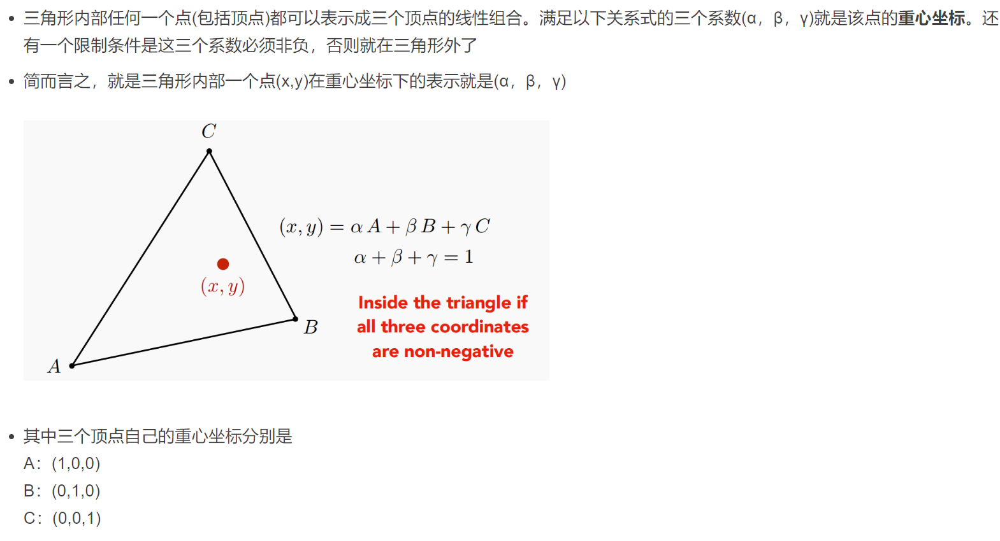
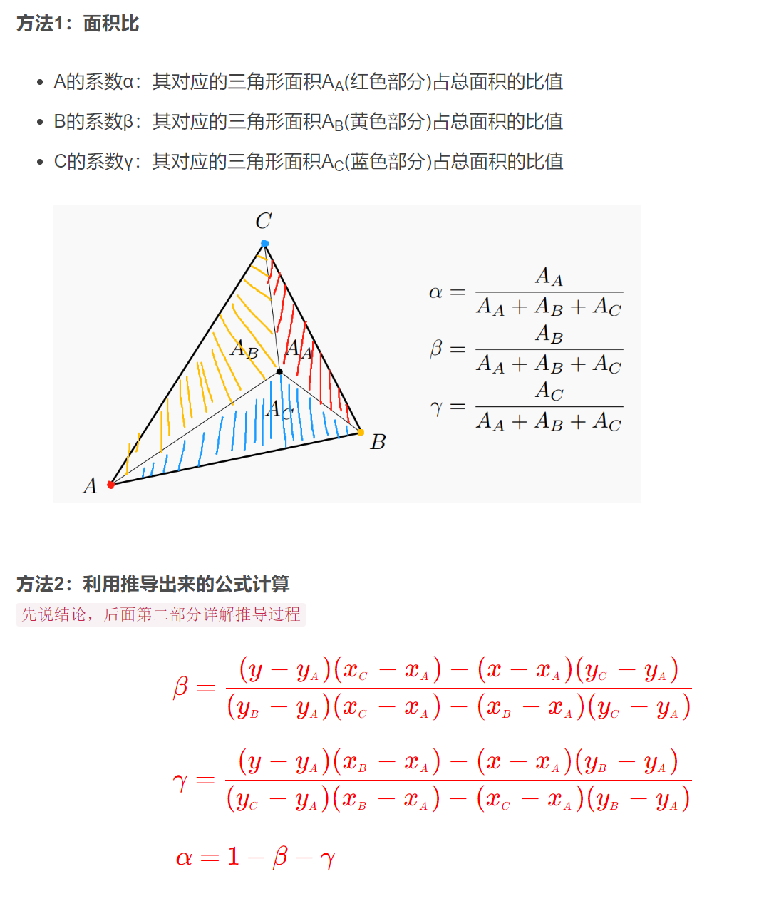
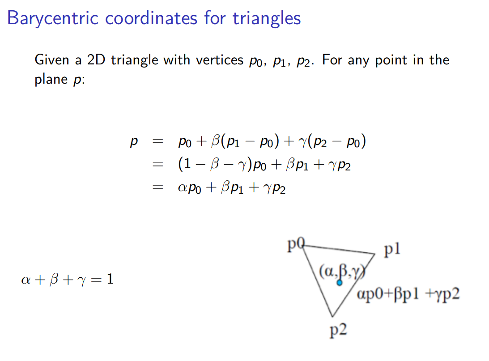
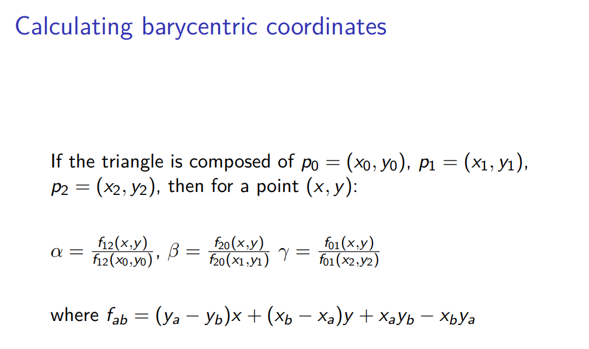
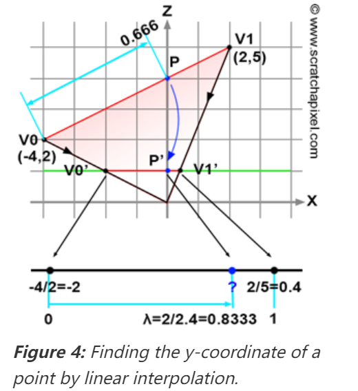
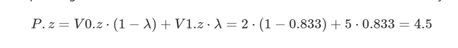
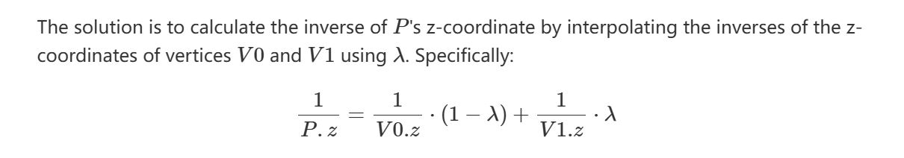
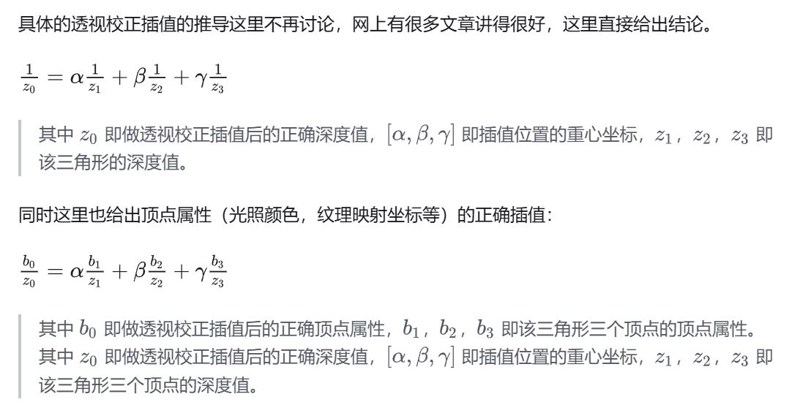
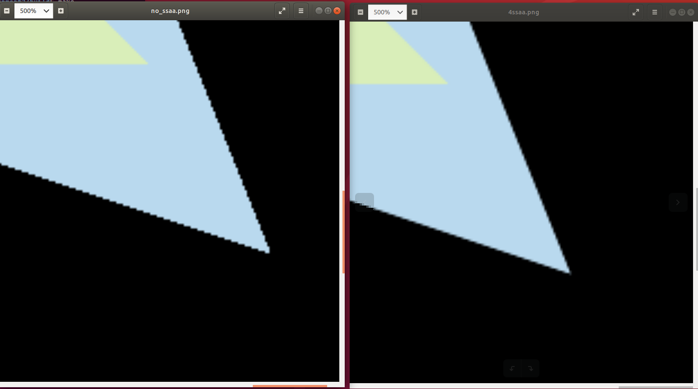

## 重心坐标（Barycentric Coordinates）

#### 什么是重心坐标




#### 怎么计算




> 这个面积比计算有个很直接的地方。例如当上面的点（x，y），假设为点P，运动到BC线段上时。此时$\alpha$，应该为0。因为A面对的三角形面积为0。此时就是退化利用B，C两点计算的二位的线性插值。

#### 怎么理解$\alpha + \beta + \gamma = 1$

其实从参考中的2有一张ppt很清楚




p1-p0可以理解为p0p1向量，同理p2-p0可以理解为p0p2向量，那么这两个向量做线性组合可以覆盖三角形内的任意方向，然后p0加上这个任意方向就能到达p点


#### 另外一种计算方法



这种写法描述更简洁


## 重心坐标的作用

这里怎么去理解这个重心坐标的作用呢？因为$\alpha + \beta + \gamma = 1$，那么其实可以理解：三个顶点做一个线性组合，自然就想到了可以用来插值（三个顶点都用上了，并且系数和为1，也没有归一化的问题）


但是对于深度的插值，并不能直接计算重心坐标，然后直接插值。这个参考3中已经给出了原话：Simply put, **perspective projection preserves lines but does not preserve distances**。即perspective distortion问题。





文章中的这个图是举了个2d的例子，非常清楚。绿色的线是canvas，v0v1是物体，v0'v1'是投影到canvas的线段相机在原点。如果拿下面的二维的重心坐标公式插值，算出来p的深度值是4.5（这个$\lambda$的值是通过p'在v0'，v1'的比例计算出来的，即模拟的是屏幕空间的重心坐标值），与p的实际深度，p的z值为4不相等。



而正确的做法应该是深度倒数插值：



推广到任意属性，就像——参考6《GAMES101》作业框架问题详解：




## 作业二中问题理解


#### 遮挡关系变反的问题

个人感觉是框架的初始化代码和闫老师的思路不匹配，向-z方向看，理论上值越大的越靠近相机。那么深度缓冲就应该初始化成一个-infinity，然后深度值大的就更新深度缓冲。

```c++
std::fill(depth_buf.begin(), depth_buf.end(), std::numeric_limits<float>::infinity());
// 因此框架中原有的初始化代码应该改成，如果下所示
std::fill(depth_buf.begin(), depth_buf.end(), -std::numeric_limits<float>::infinity());
```

然后更新深度缓冲的代码同样需要更改


#### 重心坐标计算深度插值的问题

按照闫老师的ppt，透视投影矩阵应该如下所示（下面公式中的所有值都是坐标值，因此n和f都是负值）：

$$
M_{persp}=M_{ortho} * M_{persp->ortho}= 
  \begin{pmatrix}
    \frac{2}{r-l} & 0 & 0 & -\frac{r+l}{r-l} \\  %第一行元素
    0 & \frac{2}{t-b} & 0 & -\frac{t+b}{t-b} \\  %第一行元素
    0 & 0 & \frac{2}{n-f} & -\frac{n+f}{n-f} \\  %第一行元素
    0 & 0 & 0 & 1 \\  %第一行元素
  \end{pmatrix}
  \begin{pmatrix}
    n & 0 & 0 & 0 \\ 
    0 & n & 0 & 0 \\  
    0 & 0 & n+f & -nf \\  
    0 & 0 & 1 & 0 \\ 
  \end{pmatrix}
  \\
  =
  \begin{pmatrix}
    \frac{2n}{r-l} & 0 & -\frac{r+l}{r-l} & 0 \\ 
    0 & \frac{2n}{t-b} & -\frac{t+b}{t-b} & 0 \\ 
    0 & 0 & \frac{n+f}{n-f} & -\frac{2nf}{n-f} \\ 
    0 & 0 & 1 & 0 \\  
  \end{pmatrix}
$$

> 对于这个作业一和作业二中的投影矩阵的代码，好像没有具体说明r和l，t和b。都是假设是关于坐标平面对称的？

那么可以得出结论模型坐标的坐标点依次做完M，V，P变换后，w坐标保留的是做完V变换的z坐标。即在视锥空间的深度值。因此要利用前面说的深度插值，这个深度值需要保留，而不应该被透视除法给除掉。

```c++
//Homogeneous division
for (auto& vec : v) {
    vec /= vec.w();
}
// 上面这一段代码应该排除对w的除法
for (auto& vec : v) {
    vec.x() = vec.x() / vec.w();
    vec.y() = vec.y() / vec.w();
    vec.z() = vec.z() / vec.w();
}

另外这个viewport变化对z的缩放感觉没必要，改成保留w值即可
for (auto & vert : v)
{
    vert.x() = 0.5*width*(vert.x()+1.0);
    vert.y() = 0.5*height*(vert.y()+1.0);
    // 这行代码去掉 vert.z() = vert.z() * f1 + f2;
    vert.z() = vert.w();
}    

```


最后这个深度插值的计算按照参考链接3中给出的计算方法即可：

```
auto[alpha, beta, gamma] = computeBarycentric2D(x, y, t.v);
float z_interpolated = 1.0/(alpha / v[0].z() + beta / v[1].z() + gamma / v[2].z());
```


> 这个测试数据，框架给的十分直观，能够一眼就看出遮挡关系。第一个三角形顶点的z坐标就是-2，第二个三角形顶点的z坐标就是-5，相机在（0，0，5）的位置向-z看，正方向也摆默认摆好了（ps：因为没看见有对相机正方向的旋转操作），使用rgb转换工具看看三角形颜色就能知道绿色在前了。这个时候那么进行view变换后，正确的z值（视锥空间的深度值）应该是一个-7，一个-10


## SSAA（super sampling Anti-aliasing）

其实如果根据参考5，大师的说法。那么通过在一个像素内虚拟出采样点，分别维护他们的深度值和颜色值，然后进行光栅化（主要就是测试点是否在三角形内）。最后通过求解他们的颜色平均值来设置真实像素的颜色值，这种做法，感觉像是MSAA，而不是SSAA。


这个地方等以后有时间再纠结，现在看下我的“SSAA”的效果，还是不错的哈哈！！




+ SSAA
+ MSAA（Multisampling Anti-Aliasing）。课程说理论上2*2的MSAA计算量会增加4倍，但是实际游戏中性能消耗没有4倍数。这是因为采样不是标准的正方形，采样点可以和其他像素复用，减少了计算量
+ FXAA（Fast Approximate Anti-Aliasing）。采样无关，是图像处理的方法。通过图像算法找到边界，替换带锯齿的边界。
+ TAA（Temporal Anti-Aliasing）。想象一下对于静态的物体，每次采样只是分布在像素内的某个采样点内（不一定是像素中心），然后在时间序列上就可以复用上一帧的采样点，相当于时间上做了一个MSAA。对于运动的物体，嗯，老师没讲...


内容参考（内容来自）：

1. [【重心坐标插值、透视矫正插值】原理以及用法见解(GAMES101深度测试部分讨论)](https://blog.csdn.net/Motarookie/article/details/124284471)

2. [Computer Graphics 7 - Rasterisation](https://www.inf.ed.ac.uk/teaching/courses/cg/lectures/slides7.pdf)
3. [Rasterization](https://www.scratchapixel.com/lessons/3d-basic-rendering/rasterization-practical-implementation/visibility-problem-depth-buffer-depth-interpolation.html)
4. [GAMES101投影矩阵推导详解和分析](https://juejin.cn/post/7085176703085412383)
5. [请问FXAA、FSAA与MSAA有什么区别？效果和性能上哪个好](https://www.zhihu.com/question/20236638)
6. [《GAMES101》作业框架问题详解](https://zhuanlan.zhihu.com/p/509902950)

