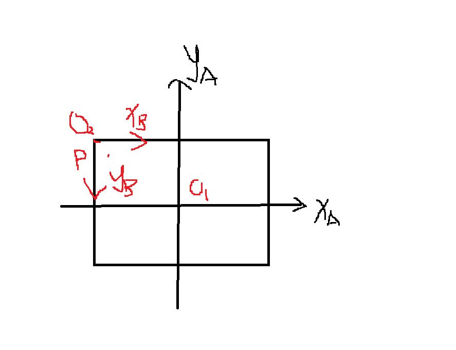
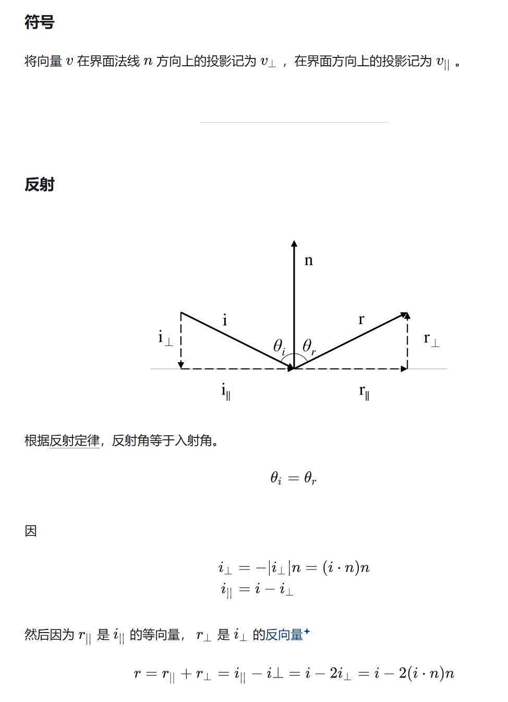
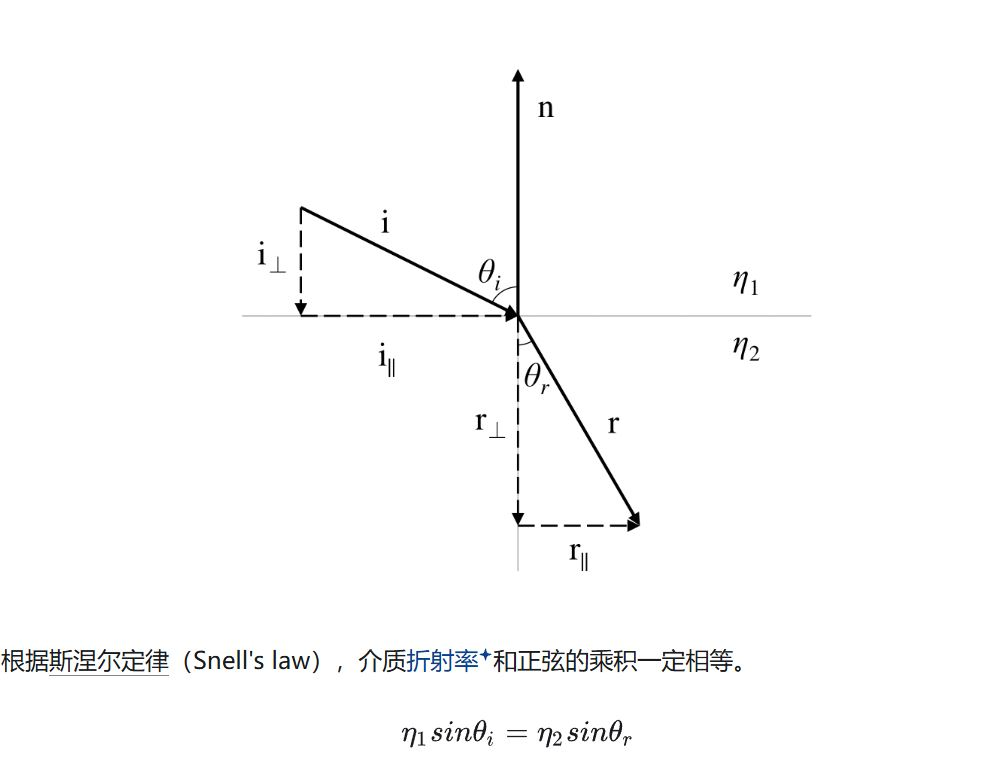
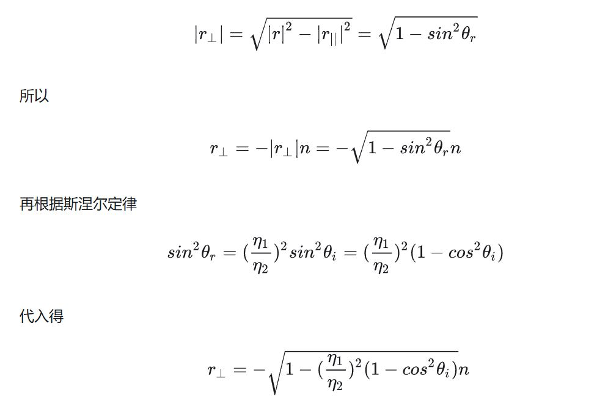
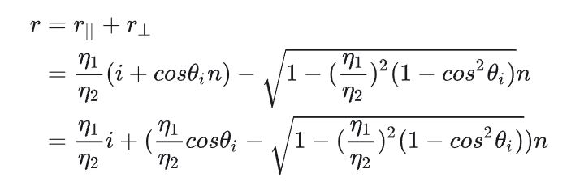
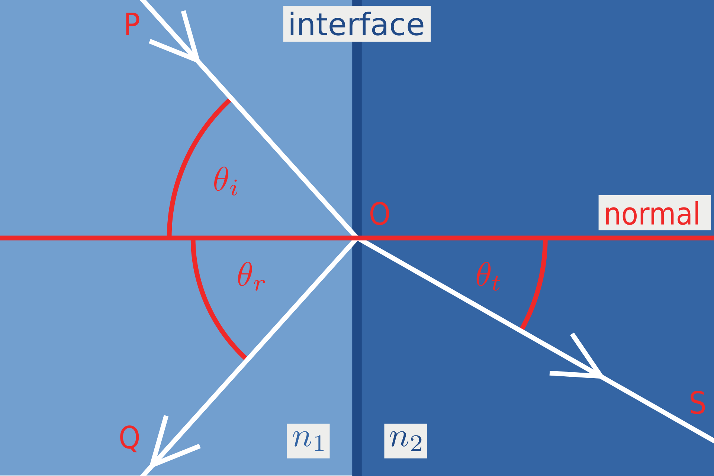
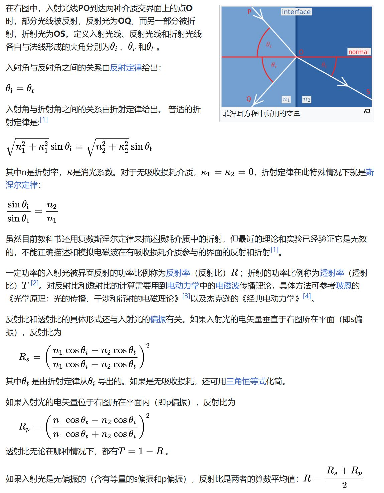
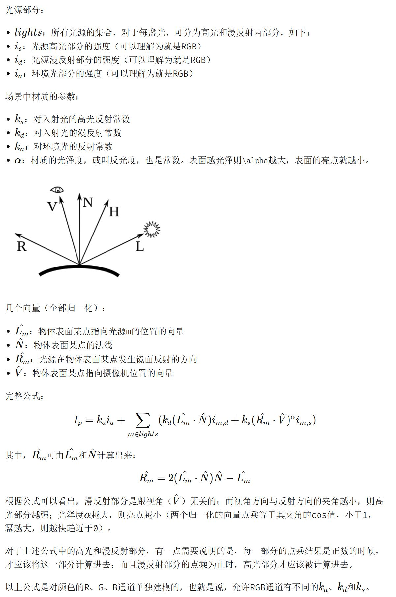
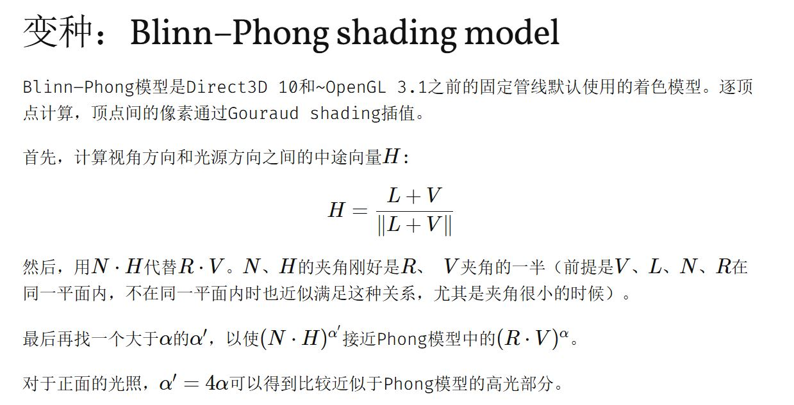

刚刚做了一个幸福的没有疑惑的作业四，马上又来了作业五，作业五中还是有一些有意思的问题的。


## 计算每个像素的光线方向向量


作业的框架代码原来是这样的，这个光想方向向量dir的计算首先看了两眼觉得有点懵。

```c++
    float scale = std::tan(deg2rad(scene.fov * 0.5f));
    float imageAspectRatio = scene.width / (float)scene.height;

    // Use this variable as the eye position to start your rays.
    Vector3f eye_pos(0);
    int m = 0;
    for (int j = 0; j < scene.height; ++j)
    {
        for (int i = 0; i < scene.width; ++i)
        {
            // generate primary ray direction
            float x;
            float y;
            // Find the x and y positions of the current pixel to get the direction
            // vector that passes through it.
            // Also, don't forget to multiply both of them with the variable *scale*, and
            // x (horizontal) variable with the *imageAspectRatio*            

            Vector3f dir = Vector3f(x, y, -1); // Don't forget to normalize this direction!
        }
    }
```

后面仔细想想才明白什么意思。因为我们知道透视投影中定义一个成像平面至少需要下面这几个参数（相机在原点，-z轴穿过成像平面的中心）：

+ 宽高比，Aspect Ratio。即width / height。
+ 成像平面距离相机的距离，zNear。
+ 视场角，fov。games作业里面用的是垂直fov，即$ tan(\frac{fov}{2}) = \frac {height / 2} {zNear}$

那么对比一下代码，就能知道哪个没有。从dir的z值为-1（dir是从相机开始，连向像素，因此dir的z方向的距离就是相机到成像平面的距离），就能知道zNear=1。


>  其实这个地方建议助教优化一下代码框架，这个写法过于粗糙，也不便于理解和调整参数。
>
> 2024.12.10更新，好吧撤回一部分。仔细看下面计算，w和h都是通过zNear计算出来的，最后单位化这个向量，zNear会约分约掉。最后计算光线方向向量是一样的。（可以想像一个视锥的最外面光线，不管你怎么移动近平面，都会不变）


有了定义参数了，就需要通过（i，j）来计算x和y。画画图也可以直接写出。但是我们用一个**更加高级的整活方法**。就是我在《view变换》中归纳总结的一般性的问题，即坐标系变换。


在坐标系变换前，需要计算一下投影平面的实际宽w和高h。根据定义，很容易写出来
$$
因为\frac{h/2}{zNear} = tan(fov/2)
\\
所以：h = 2*zNear*tan(fov/2)
\\
w = aspect\_ratio * 2*zNear*tan(fov/2)
$$


原有的坐标系命名为A。这个时候建立一个新的坐标系，命名为B。B坐标系的原点在成像平面的左上角，B的x轴为A坐标系的x轴，B的y轴为A的y轴反方向。p点就是i，j代表的点。如下图灵魂画手所示：



那么，此时就是已知$P_B$（点P在B坐标系下的坐标）。要求$P_A$。


已知条件，这里没用中心点，用没用本质上没区别$P_B$：
$$
P_B = (\frac{i}{width} * w, \frac{j}{height} * h)
\\
(\vec{O_1O_2})_A = (-w/2, h/2)
$$
根据《view变换》中的说明$P_A$，满足如下公式
$$
P_A = \sideset{^A_B}{}RP_B + (\vec{O_1O_2})_A
$$
那么只需要求出，$\sideset{^A_B}{}R$。这个矩阵是一个旋转矩阵，参考《view变换》，只要求出B的两个坐标轴在A下的坐标表示，就能直接写出这个旋转矩阵。第一列就是上图中的$x_B$单位向量在A坐标系的表示，第二列就是$y_B$单位向量在坐标系A的表示
$$
\sideset{^A_B}{}R = 
\begin{bmatrix}
1 &  0 \\
0 & -1  \\
\end{bmatrix}
$$

$$

$$
因此
$$
P_A =
\begin{bmatrix}
1 &  0 \\
0 & -1  \\
\end{bmatrix}
*
\begin{bmatrix}
\frac{i}{width} * w  \\
\frac{j}{height} * h  \\
\end{bmatrix}
+
\begin{bmatrix}
 -w / 2  \\
 h / 2  \\
\end{bmatrix}
\\
=
\begin{bmatrix}
 \frac{i}{width} * w - w / 2  \\
 -\frac{j}{height} * h + h / 2  \\
\end{bmatrix}
$$


到这里，大家可以带入i和j的特殊值试下，这个计算是没有问题的。例如i=0，j=0时候，P在左上角的B坐标系原点。算出来，然后i=width/2，j=height/2，P在A坐标系的原点时。


> 实现作业五的时候，发现一片蓝色。也就是光线与物体完全没有相交。因为这个代码中要实现的地方只有两处，一处是生成光线方向向量，一处是使用Moller Tumbore算法判断判断光线与三角形的交点。然后在Moller Tumbore处打印日志，发现t全是负数。以为是这个Moller算法实现问题。把别人正确的代码替换之后还是不行。因此就看下生成光线的代码，发现$P_A$的y坐标少了个负号。。。。 p.s sort按照某个字段进行排序时，需要使用-k，而且是 -k 2,2 这种才是按照第二个字段进行排序


## 计算反射向量

推荐阅读写的很清楚：https://zhuanlan.zhihu.com/p/91129191。下面截了一个图保存一下。



下面reflect函数的返回值就是反射方向的单位向量，就是基本翻译过来的，很简洁：

```c++
Vector3f reflect(const Vector3f &I, const Vector3f &N)
{
    return I - 2 * dotProduct(I, N) * N;
}
```


## 计算折射向量

折射向量的计算就比反射要复杂一些，反射基本不看解析还是能算出来，折射我自己算了一下，未遂。还是这个链接，写的非常清楚：https://zhuanlan.zhihu.com/p/91129191



这种稍微复杂一点的计算，首先我觉得要弄清楚思路，不然细节太多，然后看了一遍发现每句话都有道理，但是最后还是不知道怎么计算的。


在折射向量的计算中：

已知：入射光线单位向量$\boldsymbol{i}$，平面法线$\boldsymbol{n}$（法线就不用强调单位向量了吧），入射光所在介质的折射率$\eta_1$和折射光所在介质的折射率$\eta_2$

求：折射光线单位向量$\boldsymbol{r}$


**整体的思路就是求出r在上图中的水平和垂直的两个分量**。计算方法基本上都是利用向量=向量的模长*这个方向的单位向量。


因此首先作者先计算r的平行分量（利用$\boldsymbol{r_{\parallel}}$和$\boldsymbol{i_{\parallel}}$方向相同，然后再利用斯涅尔定律，最后再利用入射光线在上图中构成的三角形）：
$$
\boldsymbol{r_{\parallel}} 
= |\boldsymbol{r_{\parallel}}|\frac{\boldsymbol{i_{\parallel}}}{|\boldsymbol{i_{\parallel}}|}
= \frac{sin{\theta}_r}{sin{\theta}_i}\boldsymbol{i_{\parallel}}
= \frac{{\eta}_1}{\eta_2}\boldsymbol{i_{\parallel}}
= \frac{{\eta}_1}{\eta_2}(\boldsymbol{i} + cos{\theta}_i\boldsymbol{n})
$$


然后再计算r的垂直分量：



把两个加一起：



通过上面的的计算，已经得出了最终的结果，因为：
$$
cos{\theta}_i = - \boldsymbol{i} \cdot \boldsymbol {n}
$$
 还有一个物理问题需要保证上面式子中根号里面非负，也就是下面表达式：
$$
1 - (\frac{\eta_1}{\eta_2})^2(1 - cos^2\theta_i) \ge 0
$$
如果上面为负数，那就表示发生了全反射，即没有折射光线。根据上面表达式这种情况只有$\eta_1 > \eta_2$才有可能出现，即光密介质向光疏介质折射时。

我们来看下作业框架里面的实际代码，基本上就是翻译，不过代码中巧妙的通过了i与n的点乘，判断光线是要射入物体还是说从物体射出，因为n是物体表面法线，如果要射出的话需要反转法线方向。etai = 1表示的就是假设场景是真空的。p.s 一般情况下是合理的，哈哈但是玩过上古卷轴5的朋友在水底游泳的时候，etai就不是1了

```c++
// [comment]
// Compute refraction direction using Snell's law
//
// We need to handle with care the two possible situations:
//
//    - When the ray is inside the object
//
//    - When the ray is outside.
//
// If the ray is outside, you need to make cosi positive cosi = -N.I
//
// If the ray is inside, you need to invert the refractive indices and negate the normal N
// [/comment]
Vector3f refract(const Vector3f &I, const Vector3f &N, const float &ior)
{
    float cosi = clamp(-1, 1, dotProduct(I, N));
    float etai = 1, etat = ior;
    Vector3f n = N;
    if (cosi < 0) { cosi = -cosi; } else { std::swap(etai, etat); n= -N; }
    float eta = etai / etat;
    float k = 1 - eta * eta * (1 - cosi * cosi);
    return k < 0 ? 0 : eta * I + (eta * cosi - sqrtf(k)) * n;
}
```


##  菲涅尔方程

这里直接从维基百科截了一张图，https://zh.wikipedia.org/wiki/%E8%8F%B2%E6%B6%85%E8%80%B3%E6%96%B9%E7%A8%8B。wiki里面反射角为$\theta_r$，折射角为$\theta_t$。和前面的图里面不一样，其实应该改一下上面的推导，有时间再说吧。





直接看框架里的实现代码基本上就是使用公式计算：

```c++
float fresnel(const Vector3f &I, const Vector3f &N, const float &ior)
{
    float cosi = clamp(-1, 1, dotProduct(I, N));
    float etai = 1, etat = ior;
    if (cosi > 0) {  std::swap(etai, etat); }
    // Compute sini using Snell's law
    float sint = etai / etat * sqrtf(std::max(0.f, 1 - cosi * cosi));
    // Total internal reflection
    // 根据斯涅尔定律和全反射发生的条件就能想明白了
    // sini * etai = sint * etat 发生条件就是etai > etat，此时sini < sint。因此，增大入射角，一定会有某个时刻为了满足这个定律倒是sint >= 1
    if (sint >= 1) {
        return 1;
    }
    else {
        float cost = sqrtf(std::max(0.f, 1 - sint * sint));
        cosi = fabsf(cosi);    // 放到if (cosi > 0) 这里的else分支。并且要改一下if (cosi < 0)，像refract一样，这样代码更有一致性比较好动
        // 原来的框架代码菲涅尔方程的rs和rp写反了，不过不影响结果，我修正一下
        float Rp = ((etat * cosi) - (etai * cost)) / ((etat * cosi) + (etai * cost));
        float Rs = ((etai * cosi) - (etat * cost)) / ((etai * cosi) + (etat * cost));
        return (Rs * Rs + Rp * Rp) / 2;
    }
    // As a consequence of the conservation of energy, transmittance is given by:
    // kt = 1 - kr;
}
```


## Phong光照模型


和Blinn-Phong的计算方式稍微有点区别，但是也很好理解：https://blog.wallenwang.com/2017/03/phong-lighting-model/。





有意思的是，我在框架里面试了一下，换成了Blinn-Phong。发现确实要调大指数部分的系数才能得到和Phong差不多的的效果


