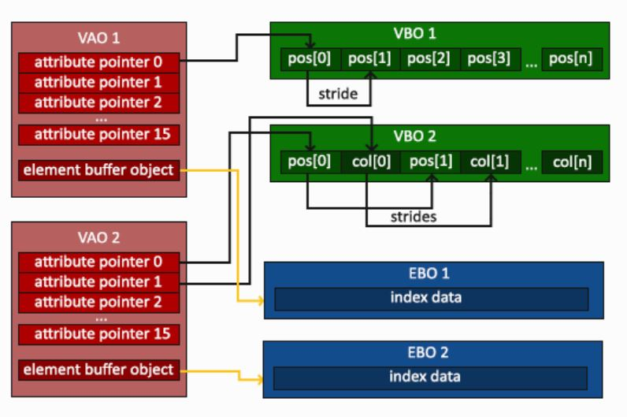
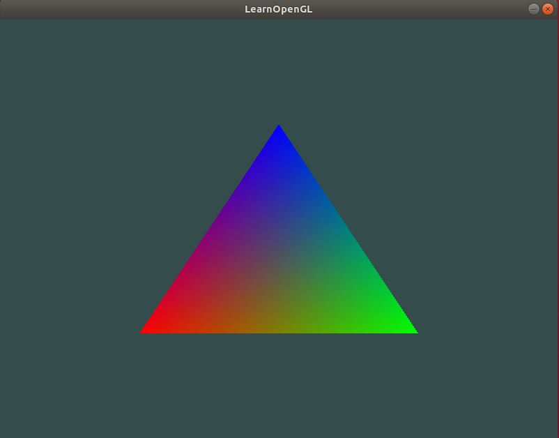
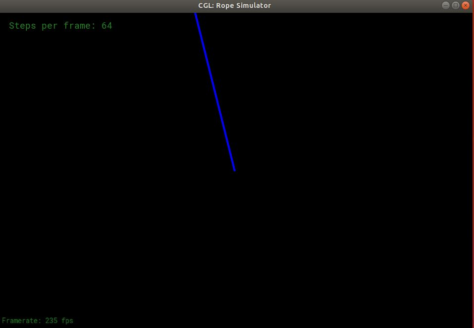
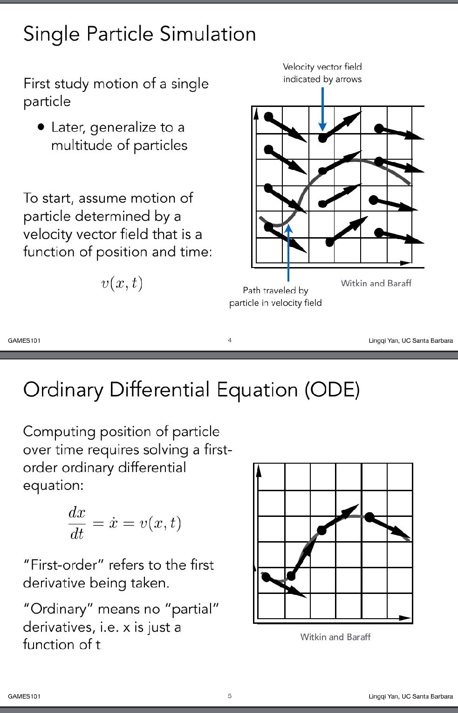
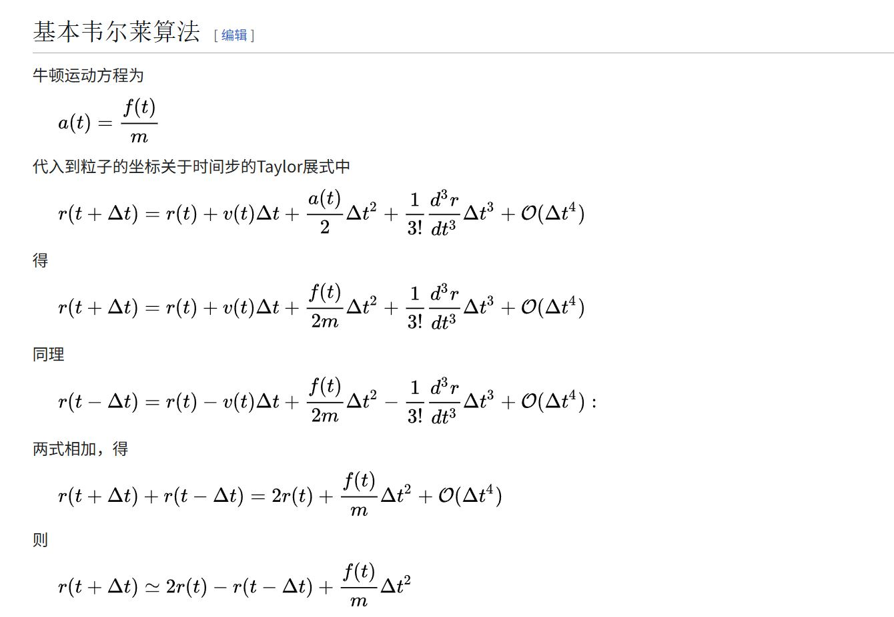
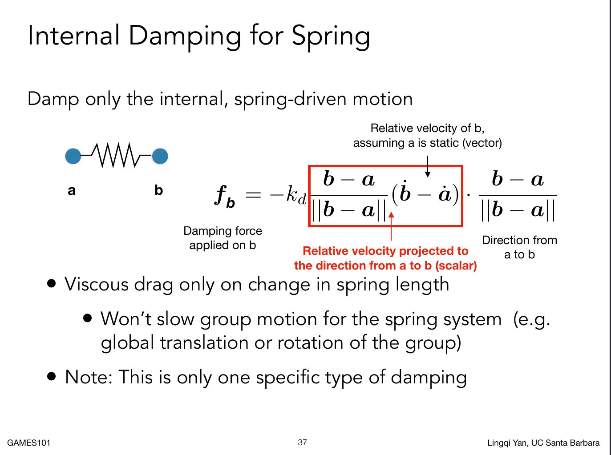

前面时间比较忙，很久没有打开vscode了。刚打开vscode就说`vscode remote host does not meet prerequisites`。那看样子就只有两种办法了，要么就升级服务器的操作系统。要么就降级这个vscode。本来打算降级一下vscode就行了(1.85版本就行）。找了半天微软的`https://update.code.visualstudio.com/1.85.2/win32-x64-user/stable`vscode打不开，就挂代理也不行奇了怪了。然后各种找镜像，没找到。结果试了一下用迅雷下载可以了....


然后打开了之后又报在remote连接中的XHR错误。XHR应该是http的请求有问题。结果搜了一下。[stack overflow的链接](https://stackoverflow.com/questions/56718453/using-remote-ssh-in-vscode-on-a-target-machine-that-only-allows-inbound-ssh-co/56781109)，说的很清楚就是http下在服务器上下载不了对应的服务器端。

一看下载的链接，又是这个域名：

```
update.code.visualstudio.com/commit:8b3775030ed1a69b13e4f4c628c612102e30a681/server-linux-x64/stable
```

然后感谢这个作者[离线安装 VS Code Server](https://www.cnblogs.com/michaelcjl/p/18262833：)，用下面的域名换成上面的vscode server对应的commit id就好了

```
https://vscode.download.prss.microsoft.com/dbazure/download/stable/${commit_id}/vscode-server-linux-x64.tar.gz
```


> p.s. 现在试又好了。折腾我好久

## opengl相关API的用法

例子来源于：https://learnopengl-cn.readthedocs.io/zh/latest/01%20Getting%20started/04%20Hello%20Triangle/。相关API的教程可以参考：[你好，三角形](https://learnopengl-cn.readthedocs.io/zh/latest/06%20In%20Practice/01%20Debugging/)


关于VAO与VBO的理解可以看下面这张图



VBO可以理解为GPU中和内存的数据绑定的缓冲块，本身只是作为数据的容器而已。它能够存储顶点的任何数据包括：位置，法线，颜色，纹理坐标等（这些数据在VAO里面有另外的名字叫做属性attribute）。


上图中的attribute pointer什么意思呢？因为VBO是个容器，那么里面是如何存储各种属性是由开发者自由发挥。例如上图中VBO 1就是位置属性紧密排布，下面VBO 2就是1个位置属性+1个颜色属性。

因此就需要设计attribute pointer来描述某种属性的距离缓冲区开始的偏移位置，属性的步长（stride），属性的大小（位置属性xyz，所以大小一般为三个浮点数）等以便能够找到当前属性的下一组数据。e.g. 知道这些参数后就能从VBO 2的pos[0]找到VBO 2的pos[1]。这也就结束了glVertexAttribPointer中为什么怎么多参数。


VAO的attribute的0，1，2...15怎么指定的？是通过glVertexAttribPointer的一个参数指定的。这个参数也确定了下面glsl的vertex shader代码的location参数该填什么值。e.g.  glVertexAttribPointer(1....)表示的是position attribute pointer 1，那么下面的location就要修改为1

```glsl
#version 330 core

layout (location = 0) in vec3 position;

void main()
{
    gl_Position = vec4(position.x, position.y, position.z, 1.0);
}
```


VAO和VBO的对应关系是怎么样的呢？

其实VAO与VBO的关系是多对多的。（VBO的就不尝试了，只说明VAO的情况）

+ 一个VAO可以对应一个VBO。上图情况
+ 一个VAO可以对应多个VBO。

一个VAO对应多个VBO情况（用了gpt帮我生成了部分代码）

```c++
#include<iostream>

// GLEW
#define GLEW_STATIC
#include <GL/glew.h>

// GLFW
#include <GLFW/glfw3.h>

// Function prototypes
void key_callback(GLFWwindow* window, int key, int scancode, int action, int mode);

// Window dimensions
const GLuint WIDTH = 800, HEIGHT = 600;

// Shaders
const GLchar* vertexShaderSource =
    "#version 330 core\n"
    "layout(location = 0) in vec3 aPos;"
    "layout(location = 1) in vec3 aColor;"
    "out vec3 vertexColor;"
    "void main()\n"
    "{\n"
    "gl_Position = vec4(aPos, 1.0);\n"
    "vertexColor = aColor;"
    "}\0";
const GLchar* fragmentShaderSource =
    "#version 330 core\n"
    "in vec3 vertexColor;\n"
    "out vec4 FragColor;\n"
    "void main()\n"
    "{\n"
    "FragColor = vec4(vertexColor, 1.0);\n"
    "}\0";

// The MAIN function, from here we start the application and run the game loop
int main()
{
    // Init GLFW
    glfwInit();
    // Set all the required options for GLFW
    glfwWindowHint(GLFW_CONTEXT_VERSION_MAJOR, 3);
    glfwWindowHint(GLFW_CONTEXT_VERSION_MINOR, 3);
    glfwWindowHint(GLFW_OPENGL_PROFILE, GLFW_OPENGL_CORE_PROFILE);
    glfwWindowHint(GLFW_RESIZABLE, GL_FALSE);

    // Create a GLFWwindow object that we can use for GLFW's functions
    GLFWwindow* window = glfwCreateWindow(WIDTH, HEIGHT, "LearnOpenGL", nullptr, nullptr);
    glfwMakeContextCurrent(window);

    // Set the required callback functions
    glfwSetKeyCallback(window, key_callback);

    // Set this to true so GLEW knows to use a modern approach to retrieving function pointers and
    // extensions
    glewExperimental = GL_TRUE;
    // Initialize GLEW to setup the OpenGL Function pointers
    glewInit();

    // Define the viewport dimensions
    int width, height;
    glfwGetFramebufferSize(window, &width, &height);
    glViewport(0, 0, width, height);

    // Build and compile our shader program
    // Vertex shader
    GLuint vertexShader = glCreateShader(GL_VERTEX_SHADER);
    glShaderSource(vertexShader, 1, &vertexShaderSource, NULL);
    glCompileShader(vertexShader);
    // Check for compile time errors
    GLint success;
    GLchar infoLog[512];
    glGetShaderiv(vertexShader, GL_COMPILE_STATUS, &success);
    if (!success)
    {
        glGetShaderInfoLog(vertexShader, 512, NULL, infoLog);
        std::cout << "ERROR::SHADER::VERTEX::COMPILATION_FAILED\n" << infoLog << std::endl;
    }
    // Fragment shader
    GLuint fragmentShader = glCreateShader(GL_FRAGMENT_SHADER);
    glShaderSource(fragmentShader, 1, &fragmentShaderSource, NULL);
    glCompileShader(fragmentShader);
    // Check for compile time errors
    glGetShaderiv(fragmentShader, GL_COMPILE_STATUS, &success);
    if (!success)
    {
        glGetShaderInfoLog(fragmentShader, 512, NULL, infoLog);
        std::cout << "ERROR::SHADER::FRAGMENT::COMPILATION_FAILED\n" << infoLog << std::endl;
    }
    // Link shaders
    GLuint shaderProgram = glCreateProgram();
    glAttachShader(shaderProgram, vertexShader);
    glAttachShader(shaderProgram, fragmentShader);
    glLinkProgram(shaderProgram);
    // Check for linking errors
    glGetProgramiv(shaderProgram, GL_LINK_STATUS, &success);
    if (!success)
    {
        glGetProgramInfoLog(shaderProgram, 512, NULL, infoLog);
        std::cout << "ERROR::SHADER::PROGRAM::LINKING_FAILED\n" << infoLog << std::endl;
    }
    glDeleteShader(vertexShader);
    glDeleteShader(fragmentShader);

    float positions[] = {// 3D 位置
                         -0.5f, -0.5f, 0.0f, 0.5f, -0.5f, 0.0f, 0.0f, 0.5f, 0.0f};

    float colors[] = {
        // RGB 颜色
        1.0f, 0.0f, 0.0f,  // 红
        0.0f, 1.0f, 0.0f,  // 绿
        0.0f, 0.0f, 1.0f   // 蓝
    };

    GLuint vao, vboPos, vboColor;

    glGenVertexArrays(1, &vao);
    glGenBuffers(1, &vboPos);
    glGenBuffers(1, &vboColor);

    glBindVertexArray(vao);

    // ---- 位置数据 VBO 绑定到 attribute 0 ----
    glBindBuffer(GL_ARRAY_BUFFER, vboPos);
    glBufferData(GL_ARRAY_BUFFER, sizeof(positions), positions, GL_STATIC_DRAW);
    glVertexAttribPointer(0, 3, GL_FLOAT, GL_FALSE, 0, (void*)0);  // layout(location=0)
    glEnableVertexAttribArray(0);

    // ---- 颜色数据 VBO 绑定到 attribute 1 ----
    glBindBuffer(GL_ARRAY_BUFFER, vboColor);
    glBufferData(GL_ARRAY_BUFFER, sizeof(colors), colors, GL_STATIC_DRAW);
    glVertexAttribPointer(1, 3, GL_FLOAT, GL_FALSE, 0, (void*)0);  // layout(location=1)
    glEnableVertexAttribArray(1);

    glBindVertexArray(0);

    // Game loop
    while (!glfwWindowShouldClose(window))
    {
        // Check if any events have been activiated (key pressed, mouse moved etc.) and call
        // corresponding response functions
        glfwPollEvents();

        // Render
        // Clear the colorbuffer
        glClearColor(0.2f, 0.3f, 0.3f, 1.0f);
        glClear(GL_COLOR_BUFFER_BIT);

        // Draw our first triangle
        glUseProgram(shaderProgram);
        glBindVertexArray(vao);
        glDrawArrays(GL_TRIANGLES, 0, 3);
        glBindVertexArray(0);

        // Swap the screen buffers
        glfwSwapBuffers(window);
    }
    // Properly de-allocate all resources once they've outlived their purpose
    glDeleteVertexArrays(1, &vao);
    glDeleteBuffers(1, &vboPos);
    glDeleteBuffers(1, &vboColor);
    // Terminate GLFW, clearing any resources allocated by GLFW.
    glfwTerminate();
    return 0;
}

// Is called whenever a key is pressed/released via GLFW
void key_callback(GLFWwindow* window, int key, int scancode, int action, int mode)
{
    if (key == GLFW_KEY_ESCAPE && action == GLFW_PRESS) glfwSetWindowShouldClose(window, GL_TRUE);
}
```

运行效果如下图，opengl自动根据顶点的颜色做了三角形重心坐标的插值。



注意VAO绑定的虽然是两个VBO，但是glVertexAttribPointer的第一个参数分别是0和1。

## opengl的屏幕坐标原点

opengl划线的代码比较简单，如下所示。只需要指定两个顶点的起始位置即可。

```
glBegin(GL_LINES);
   glVertex2d(0, 0);
   glVertex2d(-100, 400);
glEnd();
```
从下图中的效果可以得知，opengl的屏幕坐标(0, 0)的点在这个窗口画布的正中间。从左到右边是x的正方向，从下到上是y的正方向。




## 常微分方程（Ordinary Differential Equation）

其实不管Euler method（欧拉法）还是Runge-Kutta（龙格-库塔），这些都是数值分析课程里计算常微分方程的一些经典算法。但是看到闫老师的ppt，最需要理解的还是微分方程部分。




个人觉得ppt里面的速度场不好理解。但是可以从物理上给出自己的理解。位移x是时间t的函数，因为给定一个时间一定有唯一的位置x与之对应，即x(t)。这个x(t)，就是要求的运动方程。速度v是t的函数，这个也好理解，物体受外力加速或者减速，反正每个时刻都能求出与t对应的v。由于x(t), v还可以写成v(x, t)的形式。那么x对t微分就是v，即
$$
\frac{dx}{dt} = v(x, t)
$$
一个典型的常微分方程。[显示欧拉，隐式欧拉](https://www.zhihu.com/question/34780726)。相关的说明和对比。


关于[verlet积分法](https://zh.wikipedia.org/wiki/%E9%9F%A6%E5%B0%94%E8%8E%B1%E7%A7%AF%E5%88%86%E6%B3%95)推导和相关计算，就是用泰勒展开。




相关的递推公式：


## 代码中的问题

看下面的render代码，render函数是在死循环中一直被调用的。也就是说render函数运行越快，帧率越高。这样其实会导致质点移动过快的鬼畜效果，显得不是很流畅。

```c++

void Application::render() {
  //Simulation loops
  for (int i = 0; i < config.steps_per_frame; i++) {
    ropeEuler->simulateEuler(1 / config.steps_per_frame, config.gravity);
    ropeVerlet->simulateVerlet(1 / config.steps_per_frame, config.gravity);
  }
  // Rendering ropes
 ...
  // 我加上的
  std::this_thread::sleep_for(std::chrono::milliseconds(5));
  }
}
```

通过-s设置的steps_per_frame，能够显著增加计算量，降低帧率。那么感觉上就是更丝滑，但其实和simulatexxx函数返回更精确的结果基本没有关系。因为在render里面加上sleep_for函数调用，效果一样....


在隐式欧拉中增加了私货，实现了damping force，停止了沿着弹簧方向的运动。但是垂直弹簧方向没有阻尼，所以会钟摆运动一直下去。


