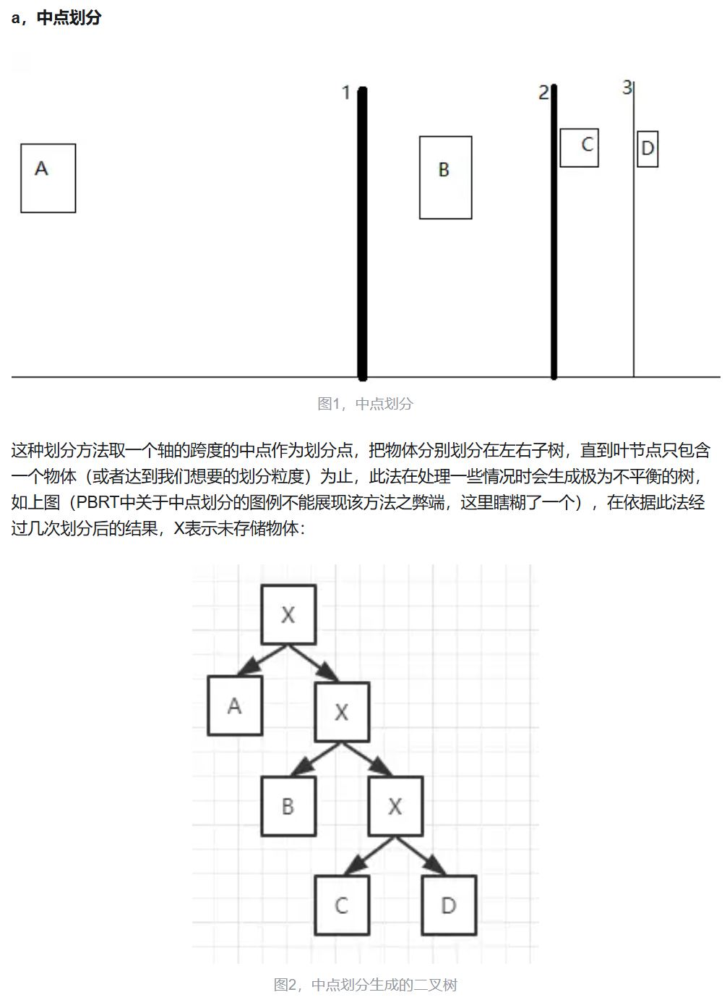
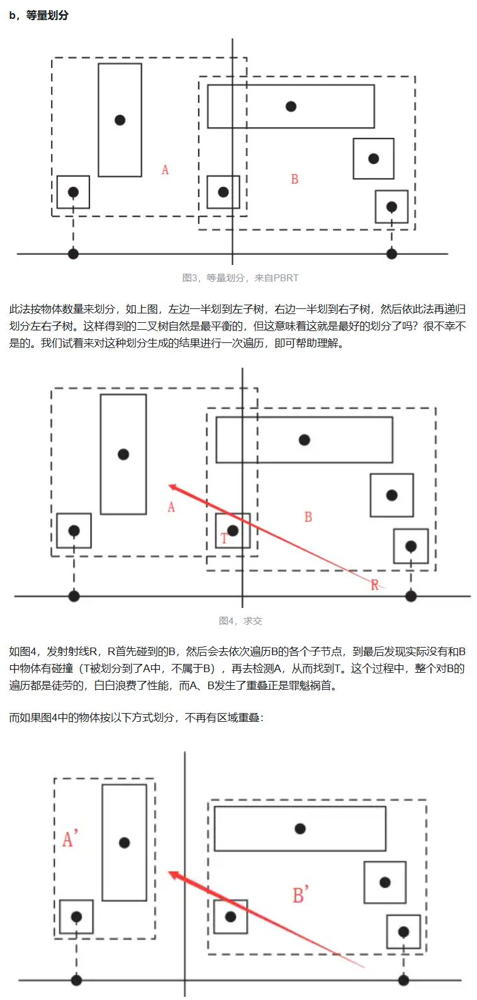
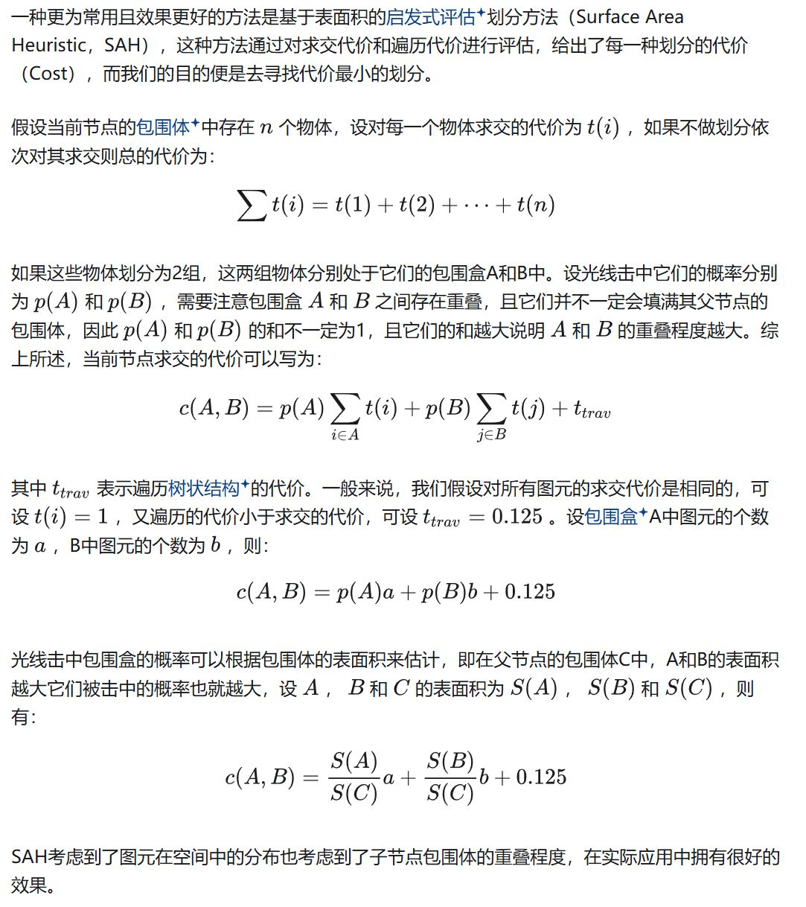
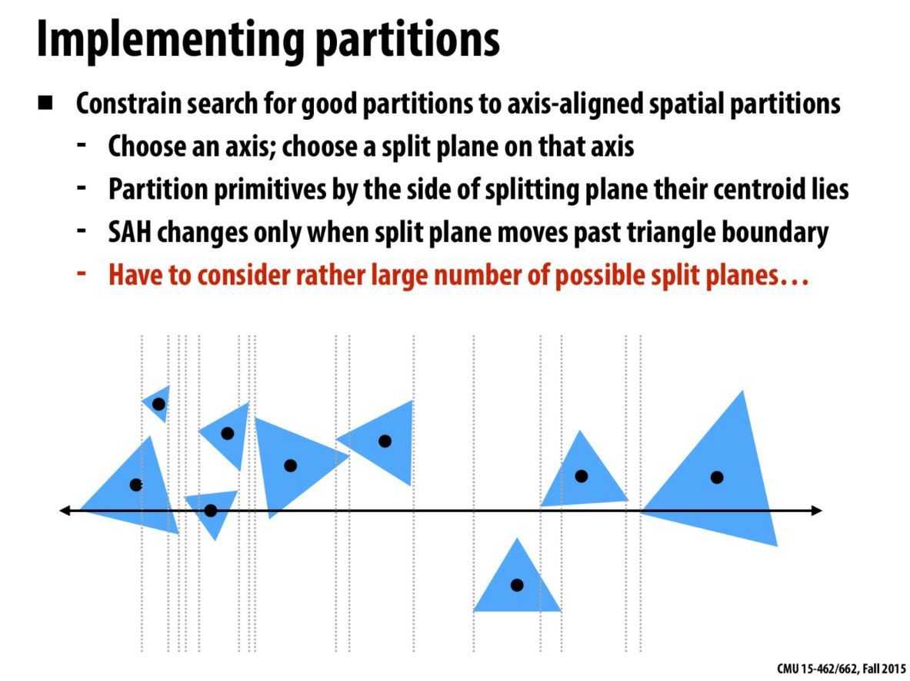
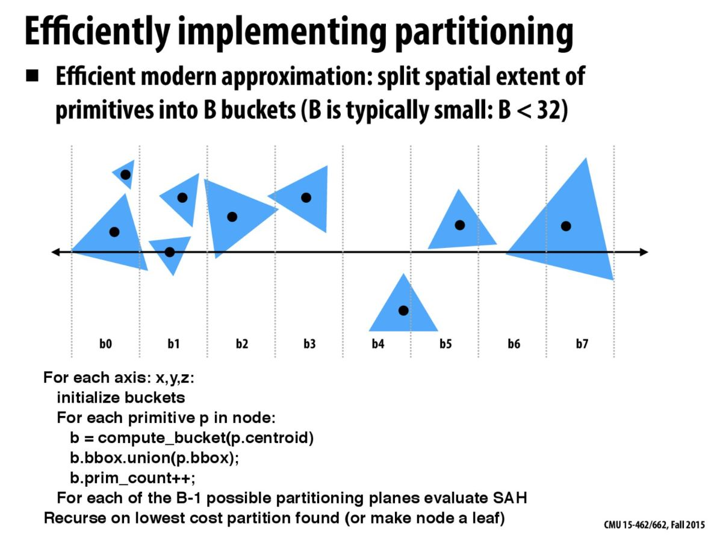
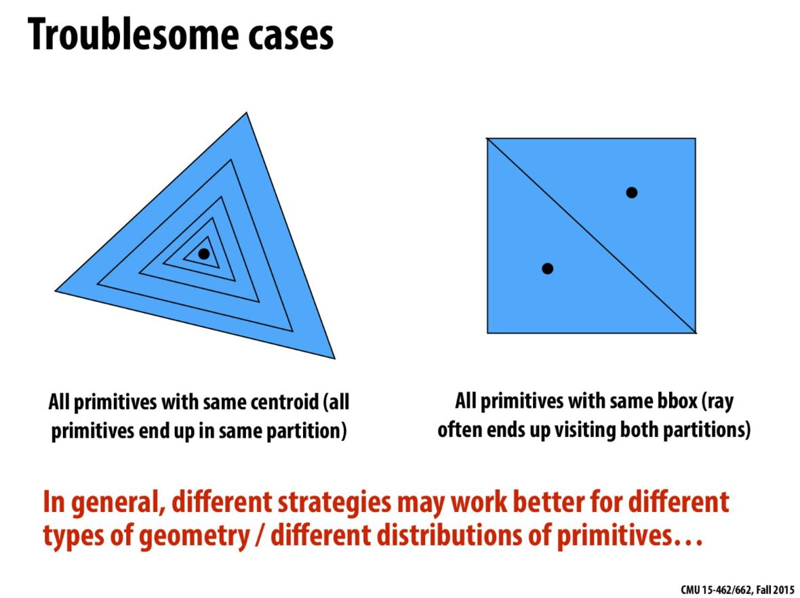
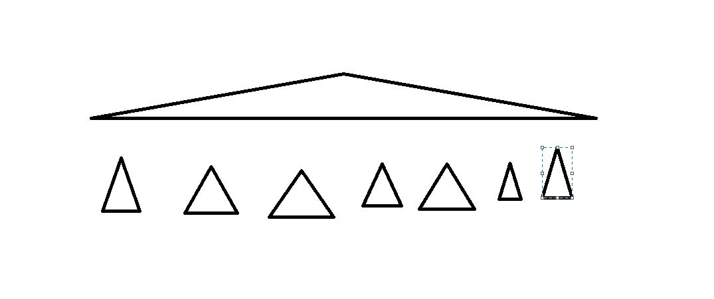

## 如何评价BVH划分的好坏

在讲SAH之前首先要提个问题：怎么样的BVH才是一个高效率的BVH？

其实总的来说就是两点：

1.  左右子树的物体数量要合理，即树要平衡
2. 左右子树代表的划分区域的重叠部分尽量可能少

## 常见的两种划分的问题

例如下面的中点划分，就会导致违背了要求1

因此，为了解决上面划分出现的问题，作业中的NAIVE方法，就是使用了下面的等量划分：

因此从上面的图中可以看出来，等量划分虽然能够保证树的平衡性，但是保证不了重叠的问题。因为等量划分根本没有考虑是否重叠

## SAH的基本假设和原理

因此为了解决重叠问题，就出现了SAH（Surface Area Heuristic）。它基于的假设就是：

- 光线是随机分布的
- 光线是不会被遮挡

使用这两点假设，就可以用物体的表面积计算图元被击中的概率。因为图元都是放在BVH的包围盒中，只要利用当前节点划分后图元所在包围盒A的表面积除以划分前当前节点的包围盒C的表面积就可以得到：A这个包围盒被击中的概率，也就是A中的图元被击中的概率。利用概率乘以每个图元求交的消耗即可以得到一个划分的代价公式。

为了简化公式，假设每个图元的求交消耗是1。其实这个假设也合理，和三角形图元求交基本就是Moller Trumber公式计算，对于任何三角形图元没有差异。下面别人文章的一个更详细的解释

其实上面公式中还有一个$t_{trav}$没有解释，这个我也没找到合理的解释。是为了公式的严谨，还是说为了能够进行递归计算，从而影响二叉树的结构？

## 具体怎么做SAH的划分

反正不管怎么说，有了评估SAH划分好坏的公式之后，接下来的任务就是怎么去具体实现。还是回到上面的问题，一共有n个物体，这些物体在包围盒C中，怎么划分成两个**非空** 的A和B两个部分？

如果仅从这个问题考虑，那么就是一个背包问题，每个物体有两种选择，左边或者右边，去掉左右两边都是空的情况$2^n -2$。如果要这么计算，那是mission impossible。

**因此我们要找到一种可行性方案。通用的做法是沿着轴进行划分。**

例如下面CMU课程的ppt中已经选好了一个轴。虚线部分就是划分的平面（仔细观察就能看出，虚线见位于图元的左右边界）。质心如果在划分平面的左侧的，那就是属于包围盒A。右侧的就属于包围盒B。**这样划分的可能性就只有2n-2种了（每个图元有两条虚线，除了最左侧和最右侧的）**。其实这样选取也是比较有道理，这样选择为了是让A和B尽可能在选择的轴上不重叠。

> 注意划分这里没有强调说要对质心进行排序，至于后续的评估每种划分的代价的时候需不需要使用那是后面的事

但是，就这还不满足。我们看ppt里面的红字。说是要考虑很多的split plane，即分平面的数量是O(n)的数量级。因为划分的平面越多，计算划分平面的代价就越大，因此我们需要一种方法减少划分平面的数量

### 使用桶减少划分平面数量

基本的思路就是将包围盒C平均分成固定数量的桶。每次取一个图元的centriod，计算它所属的桶的编号，然后更新桶的包围盒的范围和桶中图元的数量。**划分平面就是桶的交界处**。例如下面的图中：(b0)和(b1, b2, b3... b7)就是一组划分，(b0, b1)和(b2, b3...,b7)是另一组。(b0)表示属于桶b0的图元。这里第一组划分平面就是b0这个桶代表的包围盒的右边界。

代码段会对每个轴 (x, y, z) 进行操作。

- 对于每个轴，首先初始化一个桶（bucket）：创建一个大小为B的桶数组。B通常比较小，例如小于32。
- 然后计算每一个物体p的质心（centroid），看看这个物体落在哪个桶里。
  - 将物体p的包围盒与桶b的包围盒做并集操作，也就是**扩展桶b的包围盒**，使其能够包含物体p。
  - 增加桶b中的物体计数。
- 对于每个可能的划分平面（总共有B-1个），使用**表面积启发式（SAH）公式评估**其成本。
- 执行成本最低的划分（如果找不到有效的划分，就将当前节点设为叶子节点）。

注意这里还有一些问题要考虑：**怎么确定找不到划分，或者说怎么确定不是个有效划分**。不愧是CMU的课程，已经给出了答案：

+ 找不到的：质心很相近，对应上图左。这样划分出来要么在左边，要么在右边。即一边为空的情况。

+ 不是有效划分：划分之后图元的包围盒相同，对应上图右。$P(A) + P(B) > 1$。右图的场景应该是等于2

### SAH的轴选择问题

其实还有一个问题没有考虑：**前面说，通用的做法是沿着轴进行划分。沿着哪个轴呢？**我为了偷懒：就是计算图元的质心（几何中心，centriod），判断哪个轴的质心分布长度最长，就沿着哪个轴划分。

**但是个人理解CMU ppt的意思应该是3个轴都算一下**。这样的好处，用下面一张图能够说明。

写到这里就差不多应该很清楚了，代码就不贴了，因为我也没有完完全全实现上面说的，大家可以自己看到底哪里没实现，留给大家改进的余地。

内容来自：

1. [CMU 462 computer graphics](http://15462.courses.cs.cmu.edu/fall2017/lecture/acceleratingqueries/slide_026)
2. [Remyuu-作业六：SAH加速](https://docs.remoooo.com/cg01/cg/readme/zuo-ye-liu-sah-jia-su)
3. [PBRT-E4.3-层次包围体(BVH)（一）](https://zhuanlan.zhihu.com/p/50720158)
4. [如何将Surface Area Heuristic(表面面积启发式)运用到BVH的构建中？](https://www.zhihu.com/question/364497131)