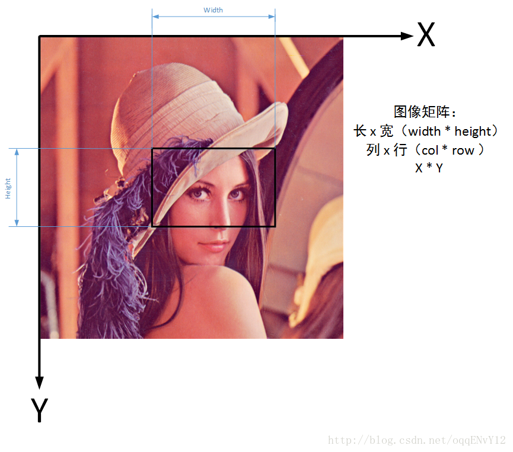

傅里叶变换本身不在于数学公式的难度，在于这个时域和频域的理解。前前后后看了一些资料，但是对于这个傅里叶变换的理解感觉始终还差一些。里面设计的概念也较多，本篇笔记不太完善。零零碎碎记录一些吧。


傅里叶变换的推导，可以看这个视频：https://www.bilibili.com/video/BV1Et411R78v/?spm_id_from=333.788&vd_source=ceb571ebda43de02b965658a7845d199

这个视频的内容和这个pdf中的有些表述类似（公式都很像）。amath231_fall_2020_lecturenotescomplete。


## 卷积定理


## opencv中一些简单概念


经常会在参数中看到一些英文参数，可以使用下面lena的图片进行辅助理解：

+ x。下图中x坐标。坐标原点是从屏幕的左上角开始
+ y。下图中的y坐标。
+ height。图片的高度，对应y上的长度
+ width。图片的宽度，对应x上的长度。
+ row。矩阵的行。对应height。一般在Mat中使用
+ col。矩阵的列。对应width。一般在Mat中使用
+ top。顶部距离。一般指特定目标距离屏幕上面的距离。copyMakeBorder（可以理解为给图片设置一个相框，常用在卷积和零填充中）中就有使用top，bottom，left，right参数。
+ bottom。底部距离。一般指特定目标距离屏幕下面的距离。
+ left。左侧距离。一般指特定目标距离屏幕左侧的距离。
+ right。右侧距离。
+ roi。Region of interest。感兴趣区域，经常配合Rect和Range，作为Mat的重载运算符()的参数。e.g. `cv::Mat m_roi = img(cv::Rect(250,300,100,100));`，这处调用中Rect的函数签名为`Rect_(int _x, int _y, int _width, int _height)`。利用前面的知识就知道，roi的高度是100，宽度也是100。



除此以外，经常可能会有需求访问mat的数据（假设mat中数据类型是，CV_8UC3 ）。

这是一种访问方式，使用at效率较低。

```
for(int i = 0; i < foo.rows; i++)
{
    for(int j = 0; j < foo.cols; j++)
    {
        Vec3b bgrPixel = foo.at<Vec3b>(i, j);
        
        // do something with BGR values...
    }
}
```

第二种

```
uint8_t* pixelPtr = (uint8_t*)foo.data;
int cn = foo.channels();
Scalar_<uint8_t> bgrPixel;

for(int i = 0; i < foo.rows; i++)
{
    for(int j = 0; j < foo.cols; j++)
    {
        bgrPixel.val[0] = pixelPtr[i*foo.cols*cn + j*cn + 0]; // B
        bgrPixel.val[1] = pixelPtr[i*foo.cols*cn + j*cn + 1]; // G
        bgrPixel.val[2] = pixelPtr[i*foo.cols*cn + j*cn + 2]; // R
        
        // do something with BGR values...
    }
}
```

第三种

```
int cn = foo.channels();
Scalar_<uint8_t> bgrPixel;

for(int i = 0; i < foo.rows; i++)
{
    uint8_t* rowPtr = foo.row(i);
    for(int j = 0; j < foo.cols; j++)
    {
        bgrPixel.val[0] = rowPtr[j*cn + 0]; // B
        bgrPixel.val[1] = rowPtr[j*cn + 1]; // G
        bgrPixel.val[2] = rowPtr[j*cn + 2]; // R

        // do something with BGR values...
    }
}
```


## 离散傅里叶变换


下面是使用opencv实现的离散傅里叶变换（c++版本）。样例代码就在opencv的sample中。


```c++
#include "opencv2/core.hpp"
#include "opencv2/highgui.hpp"
#include "opencv2/imgcodecs.hpp"
#include "opencv2/imgproc.hpp"
#include <iostream>
using namespace cv;
using namespace std;
static void help(char **argv)
{
    cout << endl
         << "This program demonstrated the use of the discrete Fourier "
            "transform "
            "(DFT). "
         << endl
         << "The dft of an image is taken and it's power spectrum is displayed."
         << endl
         << endl
         << "Usage:" << endl
         << argv[0] << " [image_name -- default lena.jpg]" << endl
         << endl;
}
int main(int argc, char **argv)
{
    help(argv);
    const char *filename = argc >= 2 ? argv[1] : "lena.jpg";
    Mat I = imread(filename, IMREAD_GRAYSCALE);
    if (I.empty())
    {
        cout << "Error opening image" << endl;
        return EXIT_FAILURE;
    }
    Mat padded; // expand input image to optimal size
    int m = getOptimalDFTSize(I.rows);
    int n = getOptimalDFTSize(I.cols); // on the border add zero values
    copyMakeBorder(I, padded, 0, m - I.rows, 0, n - I.cols, BORDER_CONSTANT,
                   Scalar::all(0));
    Mat planes[] = {Mat_<float>(padded), Mat::zeros(padded.size(), CV_32F)};
    Mat complexI;
    merge(planes, 2, complexI); // Add to the expanded another plane with zeros
    dft(complexI, complexI); // this way the result may fit in the source matrix
    // compute the magnitude and switch to logarithmic scale
    // => log(1 + sqrt(Re(DFT(I))^2 + Im(DFT(I))^2))
    split(complexI, planes); // planes[0] = Re(DFT(I), planes[1] = Im(DFT(I))
    magnitude(planes[0], planes[1], planes[0]); // planes[0] = magnitude
    Mat magI = planes[0];
    magI += Scalar::all(1); // switch to logarithmic scale
    log(magI, magI);
    // crop the spectrum, if it has an odd number of rows or columns
    magI = magI(Rect(0, 0, magI.cols & -2, magI.rows & -2));
    // rearrange the quadrants of Fourier image so that the origin is at the
    // image center
    int cx = magI.cols / 2;
    int cy = magI.rows / 2;
    Mat q0(magI, Rect(0, 0, cx, cy));   // Top-Left - Create a ROI per quadrant
    Mat q1(magI, Rect(cx, 0, cx, cy));  // Top-Right
    Mat q2(magI, Rect(0, cy, cx, cy));  // Bottom-Left
    Mat q3(magI, Rect(cx, cy, cx, cy)); // Bottom-Right
    Mat tmp; // swap quadrants (Top-Left with Bottom-Right)
    q0.copyTo(tmp);
    q3.copyTo(q0);
    tmp.copyTo(q3);
    q1.copyTo(tmp); // swap quadrant (Top-Right with Bottom-Left)
    q2.copyTo(q1);
    tmp.copyTo(q2);
    normalize(magI, magI, 0, 1,
              NORM_MINMAX); // Transform the matrix with float values into a
    // viewable image form (float between values 0 and 1).
    imshow("Input Image", I); // Show the result
    imshow("spectrum magnitude", magI);
    waitKey();
    return EXIT_SUCCESS;
}
```


**其实这段代码里面最不好理解的就是这段copyTo的代码。**

这里的作用是频谱中心化，可以参考：

https://gy23333.github.io/2020/04/17/%E5%9B%BE%E5%83%8F%E7%9A%84%E5%82%85%E7%AB%8B%E5%8F%B6%E5%8F%98%E6%8D%A2/

https://blog.csdn.net/daduzimama/article/details/80597454

把关键内容截取出来：


内容来自：

[OpenCV图像坐标系](https://github.com/makelove/OpenCV-Python-Tutorial/blob/master/ch01-%E5%85%B3%E4%BA%8EOpenCV/OpenCV%E5%9B%BE%E5%83%8F%E5%9D%90%E6%A0%87%E7%B3%BB.md)

[**Discrete Fourier Transform opencv tutorial**](https://docs.opencv.org/4.5.2/d8/d01/tutorial_discrete_fourier_transform.html)

