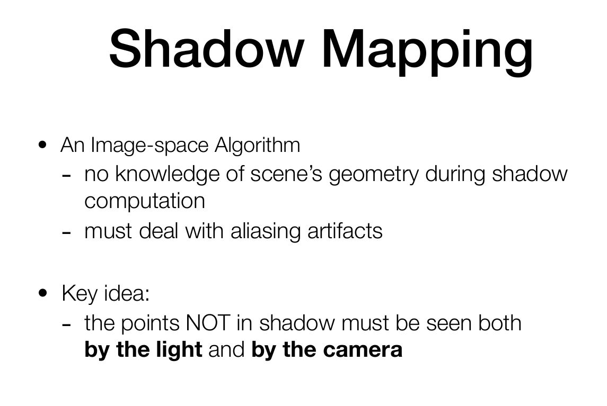

今天看这个games101的课程的时候，这个shadow-mapping的内容还是有点小疑惑，去网上搜了一下资料。发现闫老师ppt写的不是那么好理解。

上面是闫老师的定义，说不是阴影点必须要被光源和相机看见。

个人感觉这个链接的说法更好理解：https://neil3d.github.io/3dengine/shadow-mapping.html。因为判断这个点是否是阴影点只和光源有关，和相机无关。相机的位置决定了和场景的物体的遮挡关系才是决定了你能否看到这个阴影。

因此，shadow mapping的原理就是在点光源处假象一个相机（点光源空间），并且生成这个场景的一个深度图。然后在正常的shading过程中，去判断shading point和点光源的距离A（或者是z值）和shading point对应深度图上记录的距离B（或者z值）的大小，相等那就是非阴影点，不相等就是阴影点。

当然，闫教授最后说，这个shadow-mapping没有这么简单，还至少有如下问题：

1. shadow mapping理论上生成的是硬阴影。硬阴影一般没那么真实。
2. shadow mapping生成深度图的分辨率，分辨率低了，会对应场景中的很大一块区域，导致阴影粗糙有锯齿。分辨率高了，自然效果好，然后性能就差一些