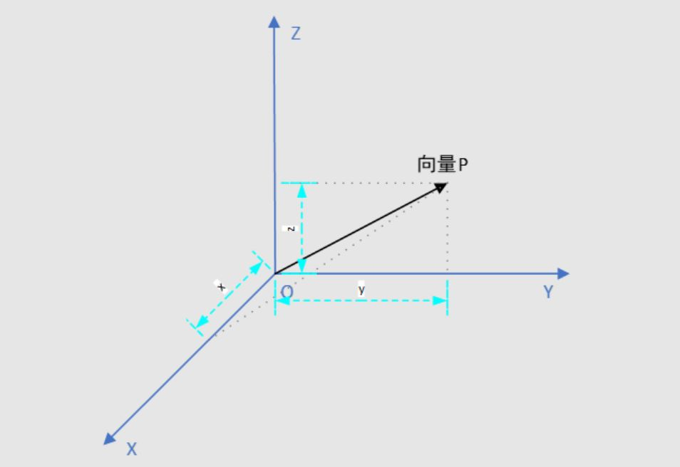

首先推荐阅读参考中的《Camera》和《lookAt() 函数》对于我加深理解很有帮助。


## 相机参数的确定

下面的代码是`glm::lookAt()`的函数签名。

```
template<typename T, qualifier Q>
GLM_FUNC_QUALIFIER mat<4, 4, T, Q> lookAt(
    vec<3, T, Q> const &eye, 
    vec<3, T, Q> const& center, 
    vec<3, T, Q> const& up
);
```

根据函数的用法（这个函数能够确定view transformation矩阵），我们知道确定一个相机只需要三个参数，eye，center，up。

+ eye。相机位置**点**，即《Camera》中的Camera position。
+ center。相机看向的**点**。eye和center构成了相机看的朝向 Camera direction。注意这个不是那么只管direction向量是(eye - center)，即与相机看向点的方向是反向的。
+ up。相机的上方向**向量**。可以理解为照相的时候对着一个物体可以横着拍，也可以竖着拍。但是这里的up可能和Camera direction**不垂直**。感觉是为了输入参数的方便(也就是说只要direction和某个up方向构成的半平面的任何一个向量都等价？)


view transformation矩阵是作用在世界坐标的模型上，将模型进行一定的旋转，缩放和平移，使得相机在世界坐标的坐标原点，朝-z方向看，向上方向是+y，所看到的图像和通过上面三个参数（eye, center, up）指定的相机看到的模型图像一样。


因此问题问题就变成了如何将看到的物体连同相机（相机空间），移动到原点（view transformation矩阵）


这个问题比较复杂，需要拆解来看，但是总的来说就是两个问题。

1. 建立相机空间
2. 求view transformation矩阵


## 建立相机空间

建立空间的思路就比较清晰。三维空间就选三个正交的单位向量就能建立一个空间。


我们要建立的是相机空间，那就是相机作为原点，还需要找出三个能作为基的向量，才能建立这个空间。至于这三个向量互相垂直与否不重要，因为可以使用Gram–Schmidt process（施密特正交化）对向量进行正交。关于施密特正交化这个过程，可以参考文献4马同学《施密特正交化》，写得很好理解。


 上面的公式中，x1，x2... ，xn就是基向量。


这个施密特正交化怎么去理解呢？今天看别的文章看到了，写的很好。《计算机图形学八：纹理映射的应用(法线贴图，凹凸贴图与阴影贴图等相关应用的原理详解)》。这里的n就是法向量，本身就是单位向量。


但是对于三维空间，有一个更加快捷的方法，那就是用叉乘。下面先介绍一下，opengl怎么选取的这三个向量的。


learn opengl的选取过程用下面四幅图就能解释说明：


这个图表示的是一个典型的右手系。

### 1. Camera position

第一个图其实就是确定相机参数过程，即上面函数的(eye，center，up)

+ 第一个图中的(0, 0, 0)，就是参数center坐标，即相机看向的点，当然也可以换成别的点
+ 第一个图中的(0, 0, 2)，就是参数eye坐标，即相机的位置

```
glm::vec3 cameraPos = glm::vec3(0.0f, 0.0f, 2.0f);    // 即eye坐标
```


### 2. Camera direction

计算相机空间中的第一个单位向量cameraDirection（这个单位向量会旋转到+z方向）。

```glsl
glm::vec3 cameraTarget = glm::vec3(0.0f, 0.0f, 0.0f);    // 即center坐标
glm::vec3 cameraDirection = glm::normalize(cameraPos - cameraTarget);
```


这个向量其实是相机朝向的反方向，为什么这么设置？

其实前面已经说了，这个cameraDirection会旋转到+z，这样就保证了相机向-z看。


### 3. Right axis

计算相机空间的第二个单位向量cameraRight （这个单位向量会旋转到+x方向）。

```glsl
glm::vec3 up = glm::vec3(0.0f, 1.0f, 0.0f); 
glm::vec3 cameraRight = glm::normalize(glm::cross(up, cameraDirection));
```

注意这个计算用到了一个up和前面计算的cameraDirection叉乘，来计算cameraRight


### 4. Up axis

计算相机空间的第三个单位向量cameraUp（这个向量会旋转到+y方向）。注意这个是修正之后的up，因为前面说过了，up和其他向量不一定正交

```glsl
glm::vec3 cameraUp = glm::cross(cameraDirection, cameraRight);
```


其实看到这里，可能还是有疑惑，这个和施密特正交化的选取方法好像毫无联系，但是这个learnopengl说使用的是施密特正交化方法？


推荐阅读参考5《Why to use Gram-Schmidt process to orthonormalise a basis instead of cross product?》

其实就是施密特正交化在$R^n$ n=3时的一个特例。


因为前面的过程可以描述为（$\vec{i}$对应cameraDirection，$\vec{j}$对应cameraRight，$\vec{k}$对应cameraUp）：
$$
\vec{i}=\frac{\vec{a}}{|\vec{a}|}  \\
\vec{j}=\frac{\vec{a} \times \vec{b}}{|\vec{a} \times \vec{b}|} \\

\vec{k}= 
\frac
{\frac{\vec{a}}{|\vec{a}|} \times \frac{\vec{a} \times \vec{b}}{|\vec{a} \times \vec{b}|}}
{\left|\frac{\vec{a}}{|\vec{a}|} \times \frac{\vec{a} \times \vec{b}}{|\vec{a} \times \vec{b}|}\right|}
= \frac{\vec{i} \times \vec{j}}{|\vec{i} \times \vec{j}|}
$$


证明过程就用文章中提到的，只需要稍微加一些注释（作者先调换了一下顺序，证明的是那一块大的叉乘就是施密特正交化的第二个等式）：


第一个等号这里，分子把模长提出去，因为常数项肯定不影响叉乘的结果。

第二个等号就需要一个数学公式，文章里也说了。具体可以参考6《三重积》


第三个等号就是分子分母除以$|\vec{a}|^2$这个常数


最后写一下施密特正交化的第二个公式：
$$
\vec{v_1} = \vec{x_1}  =  \frac{\vec{a}}{|\vec{a}|}  \\
\vec{x_2} = \vec{b} \\
\vec{v_1}是单位向量，因此\vec{v_1} \cdot \vec{v_1} = 1

\\
将上面的结果带入到下面公式中：\\
\vec{v_2} = \vec{x_2} - \frac{\vec{x_2} \cdot \vec{v_1}}{\vec{v_1} \cdot \vec{v_1}}\vec{v_1}

就得到文章中的计算结果，两者方向一致，只是一个做了标准化的单位向量
$$


因此根据上面的推导，可以得出下面这一块叉乘，其实就是计算与$\vec{v_1}$向量垂直的$\vec{v_2}$向量。$\vec{v_1}$向量又与$\vec{a}$向量相同，结合《施密特正交化》的推导过程（第二部就是在x1与x2向量内）。可以得出，下面这个结果肯定是在$\vec{a}和\vec{b}$的平面内。
$$
\frac
{\frac{\vec{a}}{|\vec{a}|} \times \frac{\vec{a} \times \vec{b}}{|\vec{a} \times \vec{b}|}}
{\left|\frac{\vec{a}}{|\vec{a}|} \times \frac{\vec{a} \times \vec{b}}{|\vec{a} \times \vec{b}|}\right|}
$$
其实用叉乘的定义，只看分子也比较只管能够看出来。


## 确定view transformation矩阵

我们定义view transformation矩阵为$M_{view}$。根据这个矩阵的作用，这个矩阵其实是两个矩阵构成。一个就是平移矩阵，将矩阵平移到坐标原点。一个是旋转矩阵，将上面构建的相机空间的坐标轴旋转到x，y，z上。


定义相关的矩阵前先定义

+ R。表示cameraRight向量。
+ U。表示cameraUp向量
+ D。表示cameraDirection向量
+ P。表示cameraPos这个点，即相机位置坐标。

平移矩阵$M_{translate}$比较容易定义
$$
M_{translate}=
\begin{pmatrix}
1 & 0 & 0 & -P_x \\
0 & 1 & 0 & -P_y \\
0 & 0 & 1 & -P_z \\
0 & 0 & 0 & 1 \\
\end{pmatrix}
$$


关键在于旋转矩阵$M_{rotate}$如何计算。根据仿射变换的定义，这个矩阵是旋转矩阵，肯定是如下的矩阵
$$
M_{rotate}=
\begin{pmatrix}
a & b & c & 0 \\
d & e & f & 0 \\
g & h & i & 0 \\
0 & 0 & 0 & 1 \\
\end{pmatrix}
$$
并且根据前面向量的旋转情况，有如下等式
$$
M_{rotate} * R 
=
\begin{pmatrix}
1 \\
0 \\
0 \\
0 \\
\end{pmatrix}
\\
M_{rotate} * U 
=
\begin{pmatrix}
0 \\
1 \\
0 \\
0 \\
\end{pmatrix}

\\
...
$$


根据闫老师提供的思路，直接求这个$M_{rotate}$矩阵并不好求，可以求这个矩阵的逆，即反向旋转，例如下面将x轴旋转到R向量上去
$$
{M_{rotate}}^{-1}
* 
\begin{pmatrix}
1 \\
0 \\
0 \\
0 \\
\end{pmatrix}
= 
\begin{pmatrix}
R_x \\
R_y \\
R_z \\
0 \\
\end{pmatrix}
\\
{M_{rotate}}^{-1}
* 
\begin{pmatrix}
0 \\
1 \\
0 \\
0 \\
\end{pmatrix}
= 
\begin{pmatrix}
U_x \\
U_y \\
U_z \\
0 \\
\end{pmatrix}
\\
...
$$
利用这个思路，就能很快求出${M_{rotate}}^{-1}$如下所示。
$$
{M_{rotate}}^{-1}
=
\begin{pmatrix}
R_x & U_x & D_x & 0\\
R_y & U_y & D_y & 0\\
R_z & U_z & D_z & 0\\
0   & 0 & 0 & 1\\
\end{pmatrix}
$$
**由于旋转矩阵是正交矩阵，它的逆就是它的转置**，因此求得$M_{rotate}$为：
$$
M_{rotate}
=
\begin{pmatrix}
R_x & R_y & R_z & 0\\
U_x & U_y & U_z & 0\\
D_x & D_y & D_z & 0\\
0   & 0 & 0 & 1\\
\end{pmatrix}
$$


最后根据上面的分析，我们可以得到
$$
M_{view} = M_{rotate} * M_{translate}=
\begin{pmatrix}
R_x & R_y & R_z & 0\\
U_x & U_y & U_z & 0\\
D_x & D_y & D_z & 0\\
0   & 0 & 0 & 1\\
\end{pmatrix}
\begin{pmatrix}
1 & 0 & 0 & -P_x \\
0 & 1 & 0 & -P_y \\
0 & 0 & 1 & -P_z \\
0 & 0 & 0 & 1 \\
\end{pmatrix}
$$


因此$M_{view}$矩阵可以计算：$P' = M_{view} * P$。P是世界空间的模型坐标，P'是相机空间的模型坐标。


## 更一般的

其实上面的问题归根到底就是一个坐标系变换的问题。因为上面的问题可以总结为：

已知：A坐标系（对应上面的世界坐标，假设该坐标原点是O1），B坐标系（对应上面的相机空间坐标，假设该坐标原点是O2），模型点P在A坐标系的坐标。

求：P在B坐标系的坐标和变换矩阵M。


这里推荐阅读参考8《坐标系变换——“旋转矩阵/欧拉角/四元数”》，但是这里加入了我的理解，应该更加清楚。

### 解决上面问题的预备知识

为了解决上面的问题，我们回顾一下向量的知识。看下面的图我们知道，这个OP向量的坐标(x, y, z)。OP这个空间向量其实可以分解为$\vec{OP} = x\vec{X}+ y\vec{Y} + z\vec{Z}$。x，y，z就是对应坐标轴的投影值。




那么理解了上面的内容就能理解下面这个图了：


P点在B坐标系的坐标是$(x_b, y_b, z_b)$，那么根据上面的理解，对这个坐标在B坐标系内进行投影，那么可以得到下面的等式
$$
\vec{O_2P} = x_b\vec{X_2} + y_b\vec{Y_2} + z_b\vec{Z_2}
$$
上面式子$\vec{X_2}, \vec{Y_2}, \vec{Z_2}$就是B坐标系的坐标轴的单位向量，那么这些**坐标轴向量可以使用A坐标系的坐标表示**，也就是图右下角列向量：
$$
\vec{X_2} = [a_x, a_y, a_z]^{\intercal} \\
\vec{Y_2} = [b_x, b_y, b_z]^{\intercal} \\
\vec{Z_2} = [c_x, c_y, c_z]^{\intercal} \\
$$
带入上面公式计算一下，就能得到$\vec{O_2p}$**在A坐标系的坐标**。(p.s.  这个应该不难理解，多写一步，这个上面的$\vec{X_2}=a_x\vec{X} + b_x\vec{Y} + c_x\vec{Z},...$，带上面算，写成坐标形式会和下面的计算一样)
$$
\vec{O_2P} = 
x_b * 
\begin{bmatrix} 
a_x \\
a_y \\
a_z \\
\end{bmatrix} 
+ 
y_b *
\begin{bmatrix} 
b_x \\
b_y \\
b_z \\
\end{bmatrix} 
+ 
z_b *
\begin{bmatrix} 
c_x \\
c_y \\
c_z \\
\end{bmatrix} 

=
\begin{bmatrix}
a_xx_b + b_xy_b + c_xz_b \\
a_yx_b + b_yy_b + c_yz_b \\
a_zx_b + b_zy_b + c_zz_b \\
\end{bmatrix}
$$
上面的公式计算再进一步：
$$
\vec{O_2P} 
=
\begin{bmatrix}
a_xx_b + b_xy_b + c_xz_b \\
a_yx_b + b_yy_b + c_yz_b \\
a_zx_b + b_zy_b + c_zz_b \\
\end{bmatrix}
=
\begin{bmatrix}
a_x & b_x & c_x \\
a_y & b_y & c_y \\
a_z & b_z & c_z \\
\end{bmatrix}
\begin{bmatrix}
x_b  \\
y_b \\
z_b \\
\end{bmatrix}
\\

令\sideset{^A_B}{}R
= 
\begin{bmatrix}
a_x & b_x & c_x \\
a_y & b_y & c_y \\
a_z & b_z & c_z \\
\end{bmatrix}
\\
(\vec{O_2P})_A = \sideset{^A_B}{}R(\vec{O_2P})_B
$$
就会神奇的发现一个矩阵$\sideset{^A_B}{}R$作用$\vec{O_2p}$上能够**实现向量从B坐标系向A坐标系的一个转换，并且很明显这是一个R是一个旋转矩阵。因为从图里面也可以看出来，只需要旋转坐标系就能实现坐标系内的向量转换**


**但是如果需要计算点P的转换呢？**

也很简单吧，还是用前面的表示方法$(\vec{O_1P})_A$表示$\vec{O_1P}$在A坐标系的坐标。下面就是一个简单的向量加法和替换：
$$
(\vec{O_1P})_A = (\vec{O_1O_2})_A + (\vec{O_2P})_A
\\
(\vec{O_1P})_A = (\vec{O_1O_2})_A + \sideset{^A_B}{}R(\vec{O_2P})_B
\\
因为(\vec{O_1P})_A向量的坐标值就是P_A
\\
因为(\vec{O_2P})_B向量的坐标值就是P_B
\\
P_A = \sideset{^A_B}{}RP_B + (\vec{O_1O_2})_A
$$


### 正式解决前面的一般问题


$$
P_A = \sideset{^A_B}{}RP_B + (\vec{O_1O_2})_A
\\
P_A + (\vec{O_2O_1})_A= \sideset{^A_B}{}RP_B
\\
P_B = (\sideset{^A_B}{}R)^{-1}(P_A + (\vec{O_2O_1})_A) \quad 等式
$$


因为旋转矩阵的逆等于它的转置：
$$
\sideset{^A_B}{}R
= 
\begin{bmatrix}
a_x & b_x & c_x \\
a_y & b_y & c_y \\
a_z & b_z & c_z \\
\end{bmatrix}
\\
\sideset{^B_A}{}R
= (\sideset{^A_B}{}R)^{-1}
= (\sideset{^A_B}{}R)^{\intercal}
=
\begin{bmatrix}
a_x & a_y & a_z \\
b_x & b_y & b_z \\
c_x & c_y & c_z \\
\end{bmatrix}
$$


P在B坐标系的坐标就可以由$P_B$等式求得。根据这个等式我们就明白了$M_{view}$为什么**先平移，再旋转**，并且平移矩阵需要加上负号了


M可以同样使用齐次坐标写出写出，就类似于$M_{view}$矩阵（因为是先平移再旋转，因此不能直接写在一个齐次坐标里面，而只能协程view变换中的那种形式，左边是齐次形式的旋转矩阵，右边是齐次形式的平移矩阵）


内容来自：

1. [Camera](https://learnopengl.com/Getting-Started/Camera)
2. [lookAt() 函数](https://000ddd00dd0d.github.io/2019/04/23/lookAt-function/)
3. 《games101 课程ppt》
4. [施密特正交化](https://www.matongxue.com/parts/4664/)
5. [Why to use Gram-Schmidt process to orthonormalise a basis instead of cross product?](https://math.stackexchange.com/questions/1847465/why-to-use-gram-schmidt-process-to-orthonormalise-a-basis-instead-of-cross-produ)
6. [三重积](https://zh.wikipedia.org/wiki/%E4%B8%89%E9%87%8D%E7%A7%AF)
7. [计算机图形学八：纹理映射的应用(法线贴图，凹凸贴图与阴影贴图等相关应用的原理详解)](https://zhuanlan.zhihu.com/p/144357517)
8. [坐标系变换——“旋转矩阵/欧拉角/四元数”](https://www.cnblogs.com/zhjblogs/p/16728697.html)