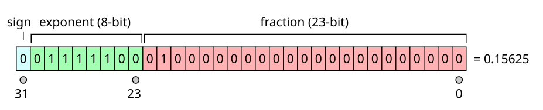
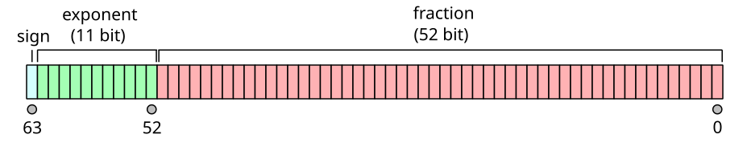

其实和图形学无关，但是由于在写图形学的代码遇到的问题，遂记录在此。


因为图形学中很多运算都是使用浮点数。浮点数在设计上复杂度远大于整数，因此有些特性或者坑点是整数没有的。

## 浮点数知识补充

其实应该将原理再讲下面的结果或者表现，原理没时间看下去，这里先写个简单的，有时间再补充

原理的知识，看看文章附录的《IEEE 754-1985》这个就行，很全。这个IEEE关于浮点数的标准：

+ IEEE 754-1985。最早的版本，硬件和软件都有实现
+ IEEE 754-2008。取代1985用
+ IEEE 754-2019。对2008的小修改




这个图中表示的就是单精度的浮点数：0.15625。如何进行转换的呢？


1. 这个10进制数就是(1/8 + 1/32)。那么转换成二进制表示就是$0.00101_2$
2. 接着用科学计数法表示$0.00101_2 =  1.01_2 * 2^{-3}$。需要表示成这种第一位是1的形式
3. fraction的部分为$.01_2$，因为表示的科学计数法第一位都是1，为了节省空间可以省略掉。
4. exponent的部分本来是-3，但是标准中计算exponent的公式是`exp + bias`。这个exp原来的带符号数字-3，**然后bias是个常数，对于单精度的是127。对于双精度的就是1023**。因此exponent = -3 + 127 = 124


至于为什么要bias的，理论一大堆（没看太懂）。说是这种方法能够在实现补码的硬件上比较数的大小（....，那不用补码就行了？）

IEEE 754 adds a [bias](https://en.wikipedia.org/wiki/Offset_binary) to the exponent so that numbers can in many cases be compared conveniently by the same hardware that compares signed [2's-complement](https://en.wikipedia.org/wiki/2's-complement) integers. Using a biased exponent, the lesser of two positive floating-point numbers will come out "less than" the greater following the same ordering as for [sign and magnitude](https://en.wikipedia.org/wiki/Sign_and_magnitude) integers. If two floating-point numbers have different signs, the sign-and-magnitude comparison also works with biased exponents. However, if both biased-exponent floating-point numbers are negative, then the ordering must be reversed. If the exponent were represented as, say, a 2's-complement number, comparison to see which of two numbers is greater would not be as convenient.


 

对于双精度的浮点数：




inf的要求：

+ sign为0或者1，0的为正inf，1的为负inf

+ exponent全1
+ fraction全0


nan的要求（[IEEE 754 2008](https://en.wikipedia.org/wiki/IEEE_754) 的）：

+ sign为0或者1都可
+ exponent全1
+ fraction没有具体要求，但是不能为全0


常见数（非数的表示）,这是双精度的：

```
     sign    exponent                 fraction
 NaN: 0    11111111111 1000000000000000000000000000000000000000000000000000
-Inf: 1    11111111111 0000000000000000000000000000000000000000000000000000
+Inf: 0    11111111111 0000000000000000000000000000000000000000000000000000
-Max: 1    11111111110 1111111111111111111111111111111111111111111111111111
+Max: 0    11111111110 1111111111111111111111111111111111111111111111111111
  +0: 0    00000000000 0000000000000000000000000000000000000000000000000000
  -0: 1    00000000000 0000000000000000000000000000000000000000000000000000
```


可以用下面代码试试

```c++
#include <cassert>
#include <cstring>
#include <cmath> // nanf, isnan
#include <iostream>
#include <limits> // std::numeric_limits

#pragma STDC FENV_ACCESS ON

void print_float(float f) 
{
    std::uint32_t i;
    std::memcpy(&i, &f, sizeof f);
    std::cout << std::hex << i << std::endl;
}

int main() 
{
    static_assert(std::numeric_limits<float>::has_quiet_NaN, "");
    static_assert(std::numeric_limits<float>::has_signaling_NaN, "");
    static_assert(std::numeric_limits<float>::has_infinity, "");

    // Generate them.
    float qnan = std::numeric_limits<float>::quiet_NaN();
    float snan = std::numeric_limits<float>::signaling_NaN();
    float inf = std::numeric_limits<float>::infinity();
    // 参数字符串支持tag bytes，会将字符串转换成数字，填充到fraction的位置
    float nan0 = std::nanf("0");
    float nan1 = std::nanf("1");
    float nan2 = std::nanf("2");
    float div_0_0 = 0.0f / 0.0f;
    float sqrt_negative = std::sqrt(-1.0f);

    // Print their bytes.
    std::cout << "qnan "; print_float(qnan);
    std::cout << "snan "; print_float(snan);
    std::cout << " inf "; print_float(inf);
    std::cout << "-inf "; print_float(-inf);
    std::cout << "nan0 "; print_float(nan0);
    std::cout << "nan1 "; print_float(nan1);
    std::cout << "nan2 "; print_float(nan2);
    std::cout << " 0/0 "; print_float(div_0_0);
    std::cout << "sqrt "; print_float(sqrt_negative);

    // Assert if they are NaN or not.
    assert(std::isnan(qnan));
    assert(std::isnan(snan));
    assert(!std::isnan(inf));
    assert(!std::isnan(-inf));
    assert(std::isnan(nan0));
    assert(std::isnan(nan1));
    assert(std::isnan(nan2));
    assert(std::isnan(div_0_0));
    assert(std::isnan(sqrt_negative));
}
```

代码输出如下（gcc version 7.5.0 (Ubuntu 7.5.0-3ubuntu1~18.04) ）：

```
qnan 7fc00000
snan 7fa00000
 inf 7f800000
-inf ff800000
nan0 7fc00000
nan1 7fc00001
nan2 7fc00002
 0/0 ffc00000
sqrt ffc00000
```

从上面代码我们可以知道。nan的表示分成了至少三种值：

+ 是0/0的，0xffc00000。即浮点数的算数运算能够出现的。

+ qnan。0x7fc00000。

+ snan。0x7fa00000

虽然三种看起来不同，但是仔细看前面的定义，这几种都是nan。

> 这里可以用std::cout打印以下0.0 / 0.0，就会发现输出是-nan，就知道这个-nan就是相对于qnan来的。


那qnan（Quiet NaN，感觉浮点数运算不能出现）和snan（Signaling NaN，这是程序赋予的特殊值，浮点运算中不会出现）呢是什么？用下面这个例子就能明白，注意不要开编译优化

```c++
#include <cassert>
#include <cfenv>
#include <cmath> // isnan
#include <iostream>
#include <limits> // std::numeric_limits
#include <unistd.h>

#pragma STDC FENV_ACCESS ON

int main() {
    float snan = std::numeric_limits<float>::signaling_NaN();
    float qnan = std::numeric_limits<float>::quiet_NaN();
    float f;

    // No exceptions.
    assert(std::fetestexcept(FE_ALL_EXCEPT) == 0);

    // Still no exceptions because qNaN.
    f = qnan + 1.0f;
    assert(std::isnan(f));
    if (std::fetestexcept(FE_ALL_EXCEPT) == FE_INVALID)
        std::cout << "FE_ALL_EXCEPT qnan + 1.0f" << std::endl;

    // Now we can get an exception because sNaN, but signals are disabled.
    f = snan + 1.0f;
    assert(std::isnan(f));
    if (std::fetestexcept(FE_ALL_EXCEPT) == FE_INVALID)
        std::cout << "FE_ALL_EXCEPT snan + 1.0f" << std::endl;
    feclearexcept(FE_ALL_EXCEPT);

    // And now we enable signals and blow up with SIGFPE! >:-)
    feenableexcept(FE_INVALID);
    f = qnan + 1.0f;
    std::cout << "feenableexcept qnan + 1.0f" << std::endl;
    f = snan + 1.0f;
    std::cout << "feenableexcept snan + 1.0f" << std::endl;
}
```

这个例子的输出：

```
FE_ALL_EXCEPT snan + 1.0f
feenableexcept qnan + 1.0f
Floating point exception (core dumped)
```


从这个例子中可以明白：

+ snan + 1.0会产生FE_INVALID，但是qnan + 1.0不会
+ Linux产生异常的条件需要feenableexept函数的支持，但是这个是glibc的一个扩展，不是c++的标准。


## INF

INF表示的就是一个极限。在数学中极限有正负，因此这个INF也有正负。产生INF的方法有很多。

以下都会：

+ $\frac{正常浮点数}{0.0}$为inf。正常浮点数就是非inf和nan。
+ $\frac{负的正常浮点数}{0.0}$为-inf。
+ `正常浮点数 + inf = inf`。
+ `log(0.0) = -inf`


+inf大于任何数（除了它自己和nan），-inf小于任何数（除了它自己和nan）


## NaN

这个好理解，NaN。Not a Number是数学中的未定义行为，即数学中的UB。对于有nan的数参与的运算都没有其他意义。哪些浮点数的运算会产生NaN呢？

以下都有会：

+ `sqrt(负的正常浮点数)`。
+ `log(负的正常浮点数)`。
+ `float result`。这个表示未初始化的浮点数。为什么

上面的好理解，接下来的有点绕：

+ `0.0 * inf`。

+ $\frac{0.0}{0.0}=inf$。这个怎么理解，可以理解为0 * (1.0 / 0.0)，就是0 * inf
+ $\frac{inf}{inf}$。
+ `inf - inf`。


**nan几个特性就是**：

+ NaN不等于任何数，包括它自
+ 如果一个运算的任何一个操作数是NaN，那么运算结果也将是NaN


> 在c++中，整个nan既然可以用特定的二进制串表示，那么nan != nan是在哪里实现的呢？


cmath中，nan和inf的测试：

+ `isfinite(x)` ，判断x是否有限，是返回1，其它返回0；
+ `isinf(x)` 
+ `isnormal(x)`，判断x是否为一个数（非inf或nan），是返回1，其它返回0；
+ `isnan(x)`，当x时nan返回1，其它返回0；


内容来自

1. [IEEE 754-1985](https://en.wikipedia.org/wiki/IEEE_754-1985#Representation_of_non-numbers)
2. [C语言中的nan和inf 的判断和使用](https://blog.csdn.net/wokaowokaowokao12345/article/details/72846436)
3. [C++ 中的 NaN：产生原因、特性及处理方法](https://www.51cto.com/article/789675.html)
4. [[What is the difference between quiet NaN and signaling NaN?](https://stackoverflow.com/questions/18118408/what-is-the-difference-between-quiet-nan-and-signaling-nan)](https://stackoverflow.com/questions/18118408/what-is-the-difference-between-quiet-nan-and-signaling-nan)